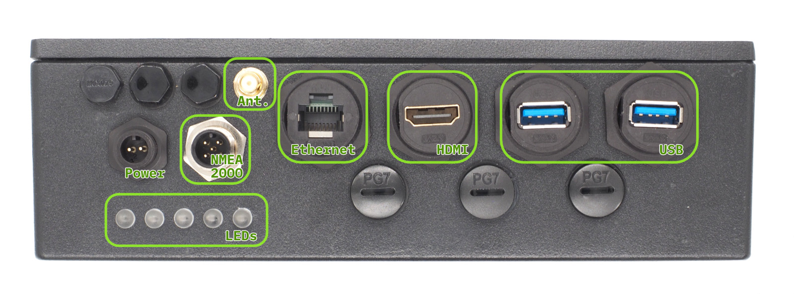
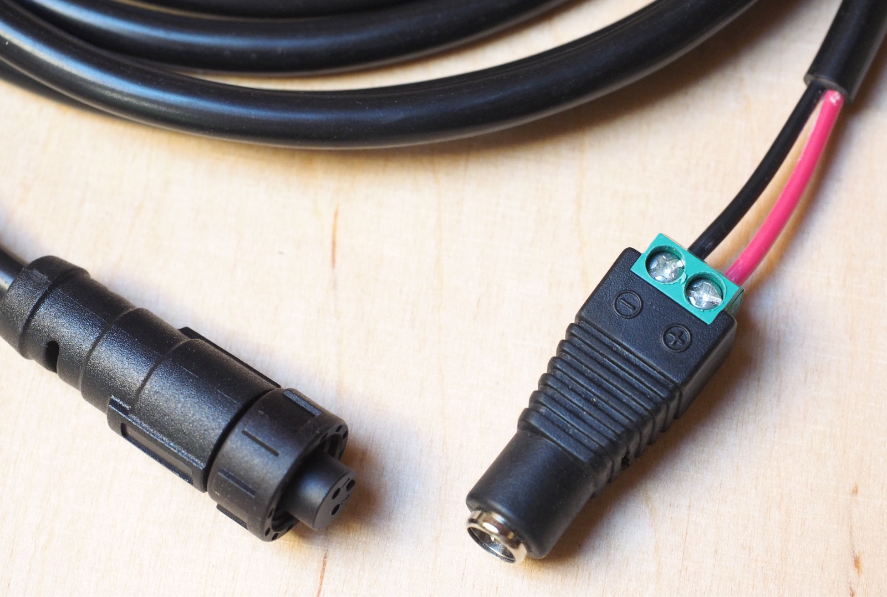
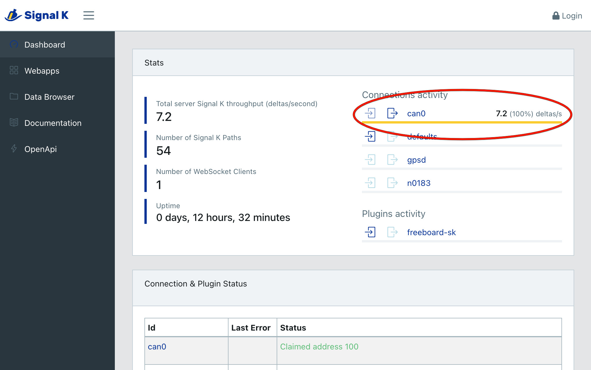
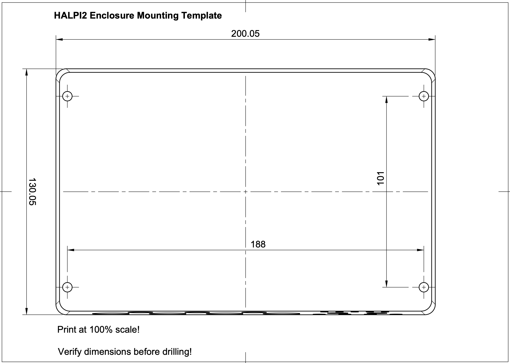
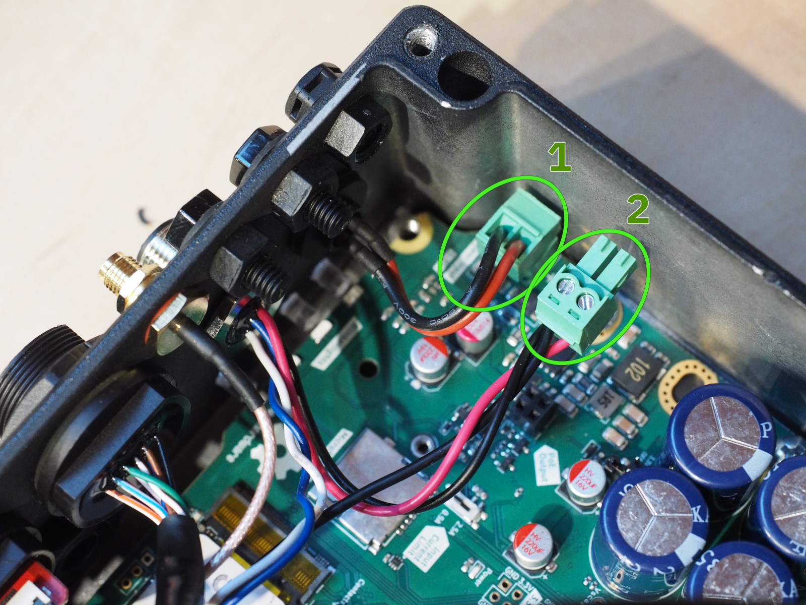

# Aloitusopas

Tämä opas saa HALPI2:n toimintaan alle 30 minuutissa ja käsittelee myös kiinteän asennuksen. Seuraa vaiheita järjestyksessä: aloita pöytäkokoonpanolla ja varmista että kaikki toimii, ja siirry vasta sitten kiinteään asennukseen.

## Turvallisuus ja käsittelyohjeet

!!! warning "Ennen kuin aloitat"
    - Varmista että sähköjärjestelmä on jännitteetön ennen kytkentöjen tekemistä
    - Käytä virransyöttöön sopivia sulakkeita (3–5 A)
    - Käsittele laitetta varoen — vaikka se on kestävä, putoaminen tai isku voi vaurioittaa sisäisiä osia
    - Varmista oikea napaisuus virtakaapeleita kytkiessäsi
    - Vältä staattisen sähkön purkauksia — maadoita itsesi äläkä hiero kissoja tai meripihkaa ennen kuin kosket sisäisiin osiin

## Mitä tarvitset

HALPI2-pakkauksesta:

- HALPI2-laite, jossa on valmiiksi asennettuna CM5 ja NVMe SSD
- Virtakaapeli E7T-liittimellä (pituus 2 m)

Valinnaiset osat (sisältyvät myyntipakkaukseen):

- DC-pyöröliitinpari (5,5 × 2,1 mm), jos käytät tavallista 12 V:n pistokemuuntajaa
- Raspberry Pi -WiFi/Bluetooth-antenni (tarvitaan, jos käyttöönotossa käytetään WiFiä)

Lisäksi tarvittavat (eivät sisälly toimitukseen):

- 12 V:n tai 24 V:n virtalähde
- Erillinen tietokone käyttöönottoon ilman näyttöä (headless), jos et käytä kytkettyä näyttöä
- Verkkokaapeli (valinnainen, langallista yhteyttä varten)
- Näyttö, jossa on HDMI-tulo (valinnainen)
- USB-näppäimistö ja -hiiri (valinnainen, suoraa käyttöä varten)

!!! tip "Vinkki"
    Useimmat verkkolaitteet, kuten reitittimet ja WiFi-tukiasemat, käyttävät 12 V:n virtalähdettä, joka käy myös HALPI2:lle. Kaiva sellainen vanhojen laitteiden kasasta!

## Pöytäkokoonpano

Suosittelemme kokeilemaan HALPI2:ta pöydällä tai työpenkillä ennen kiinteää asennusta. Käyttöönoton voi tehdä joko ilman näyttöä (headless) verkkoyhteyden yli tai kytketyn näytön, näppäimistön ja hiiren avulla. Ilman näyttöä tehtävä käyttöönotto onnistuu joko langallisella ethernet-yhteydellä tai HALPI2:n WiFi-tukiaseman kautta.

### Vaihe 1: Kytke välttämättömät oheislaitteet

#### Käyttöönottoa varten:

1. **Verkkoyhteys (pakollinen ilman näyttöä tehtävässä asennuksessa):**
   - Kytke ethernet-kaapeli
   - Kytke WiFi/Bluetooth-antenni

2. **Näyttöyhteys (valinnainen):**
   - Kytke HDMI-näyttö suoraa käyttöä varten
   - USB-näppäimistö ja -hiiri, jos käytät näyttöä

*Etupaneelin liittimet*

### Vaihe 2: NMEA 2000 -liitäntä (valinnainen)

Jos asennat HALPI2:n suoraan veneeseen tai sinulla on NMEA 2000 -kokoonpano pöydällä, voit liittää sen NMEA 2000 -verkkoon jo tässä vaiheessa.

[NMEA 2000 -verkko](https://docs.hatlabs.fi/nmea2000/) koostuu runkokaapelista, johon kaikki laitteet liitetään T-liittimillä ja haarakaapeleilla. Lisää T-liitin NMEA 2000 -verkon runkokaapeliin. Liitä HALPI2:n NMEA 2000 -microliitin T-liittimeen NMEA 2000 -haarakaapelilla.

### Vaihe 3: Virransyötön kytkentä

!!! tip "Huomio NMEA 2000 -syötöstä"
    HALPI2:lle voi syöttää virran myös NMEA 2000 -väylästä. Katso [Virransyöttö NMEA 2000 -väylästä](#virransyotto-nmea-2000-vaylasta) jäljempänä Kiinteä asennus -osiosta.

Pöytäkokoonpanossa käytetään mukana tullutta E7T-virtakaapelia. Kytke virtakaapelin johtimien päät naaraspuoliseen pyöröliittimeen seuraavasti:

- **Punainen johdin = plus (+)**
- **Musta johdin = miinus (−)**

*Esimerkki E7T-liittimen ja pyöröliittimen johdotuksesta*

Kytke tavallinen 12 V:n tai 24 V:n virtalähde pyöröliittimeen. Varmista että virtalähteen mitoitus on vähintään 1 A, jotta se riittää HALPI2:lle.

!!! warning "Varoitus"
    Ruuviliitäntäisessä pyöröliittimessä ei ole vedonpoistoa, joten sitä tulee käyttää vain väliaikaisissa asennuksissa. Kaapelin tahaton vetäminen voi irrottaa johtimet ja jättää ne paljaiksi.

## Ensikäynnistys

HALPI2:n mukana toimitetaan [HaLOS](https://docs.halos.fi), konttipohjainen Linux-jakelu, jota hallitaan selaimesta ja joka on suunniteltu vene- ja teollisuuskäyttöön. Jos haluat käyttää jotain muuta käyttöjärjestelmää, kuten OpenPlotteria tai Raspberry Pi OS:ää, katso [Ohjelmisto-opas](../user-guide/software.md).

!!! info "HaLOS-dokumentaatio"
    Tämä opas käsittelee HALPI2:n laitteistoa ja ensimmäistä käynnistystä. Kaikki käyttöjärjestelmää koskeva — ensikäynnistyksen asetukset, verkko, sovellukset, varmenteet ja päivittäinen käyttö — löytyy **[HaLOS-dokumentaatiosta](https://docs.halos.fi)**. Pidä se avoinna kun käyt alla olevia vaiheita läpi.

**Käynnistä HALPI2** kytkemällä virtalähde, ellet ole jo tehnyt sitä. Muutaman sekunnin kuluttua LED-rivin pitäisi alkaa täyttyä punaisilla valoilla, mikä kertoo superkondensaattorien latautuvan. LEDit muuttuvat keltaisiksi kun järjestelmä käynnistyy, ja lopulta vihreiksi kun käyttöjärjestelmä on käynnissä ja HALPI-daemon on yhteydessä ohjaimeen.

Jos näyttö on kytkettynä, näet Raspberry Pi OS:n aloitusruudun ja lopulta graafisen työpöydän.

!!! tip "Vinkki"
    Tila-LEDien vilkkumiskuviot on kuvattu [Järjestelmän käyttö](../user-guide/operation.md) -sivulla.

### HALPI2:n käyttö ilman näyttöä

Jos näyttöä ei ole kytkettynä, voit käyttää HALPI2:ta sen WiFi-tukiaseman tai ethernet-yhteyden kautta. HaLOSissa on selainkäyttöliittymä, joten muuta ohjelmistoa ei tarvita[^ssh].

[^ssh]: SSH on käytettävissä myös näytöttömissä HaLOS-levykuvissa (oletuksena päällä). Desktop-versioissa SSH otetaan käyttöön `raspi-config`-työkalulla. Oletustunnukset: käyttäjätunnus `pi`, salasana `halos`.

Odota ensin että LEDit muuttuvat vihreiksi, mikä kertoo järjestelmän käynnistyneen kokonaan. Etene sitten näin:

**Vaihtoehto 1 — Yhteys WiFi-tukiaseman kautta:** HaLOS luo WiFi-tukiaseman nimeltä `Halos-XXXX` (laitekohtainen) salasanalla `halos1234`. Yhdistä tietokoneesi tähän verkkoon.

Tukiasemalla ei ole omaa internetyhteyttä, joten seuraavaksi HALPI2 ohjataan WiFi-verkkoon jossa sellainen on. Tätä tarvitaan konttisovellusten lataamiseen ensikäynnistyksessä:

1. Avaa Cockpit osoitteessa `https://halos.local:9090/` ja kirjaudu sisään (käyttäjätunnus `pi`, salasana `halos`).
2. Siirry kohtaan **Networking** ja napsauta **WiFi (wlan0)**.
3. Odota että saatavilla olevien verkkojen luettelo ilmestyy, ja napsauta omaa verkkoasi.
4. Syötä salasana ja napsauta **Add**.

HALPI2 pitää `Halos-XXXX`-tukiaseman päällä liittyessään verkkoosi, joten tietokoneesi saattaa hetkeksi pudota tukiasemasta ja yhdistyä uudelleen itsestään.

**Vaihtoehto 2 — Yhteys langallisella ethernetillä:** Jos olet kytkenyt HALPI2:n verkkoosi ethernetillä, se saa IP-osoitteen automaattisesti DHCP:llä.

Kun yhteys on muodostettu, avaa selain ja siirry osoitteeseen:

- **Koontinäyttö:** `https://halos.local/` — Homarrin koontinäyttö, josta on linkit kaikkiin asennettuihin sovelluksiin
- **Järjestelmänhallinta:** `https://halos.local:9090/` — Cockpit järjestelmän hallintaan, päivityksiin ja konttisovelluksiin

!!! note "Varoitus SSL-varmenteesta"
    Kun avaat koontinäytön tai Cockpitin ensimmäistä kertaa, selain näyttää "Not secure" -varoituksen. HaLOS allekirjoittaa verkkopalvelunsa varmenteen myöntäjällä (CA), jonka se luo itse laitteella, eikä selaimesi vielä luota siihen. Hyväksy varoitus toistaiseksi päästäksesi eteenpäin.

    Saat varoituksen pois pysyvästi asentamalla laitteen CA:n tietokoneellesi kerran — sen jälkeen jokainen HaLOS-palvelu todentuu puhtaasti kaikissa porteissa. Avaa `https://halos.local/ca/`, josta löydät ohjatun asennuksen käyttöjärjestelmäkohtaisesti, tai katso [Trust the device](https://docs.halos.fi/user-guide/trust-the-device/) HaLOS-dokumentaatiosta.

!!! info "Internetyhteys vaaditaan ensikäynnistyksessä"
    Cockpit on käytettävissä heti, mutta koontinäyttö ja muut konttipohjaiset sovellukset tarvitsevat ensikäynnistyksessä internetyhteyden ladatakseen konttikuvansa. Kytke HALPI2 internetiin ethernetillä tai määritä WiFi Cockpitin kautta.

### Ensikäynnistyksen asetukset

!!! warning "Varoitus"
    HaLOSissa on oletussalasanat, jotka **täytyy** vaihtaa ensikäynnistyksen yhteydessä, jotta laitteeseen ei pääse luvatta.

HaLOSissa on kahdet tunnukset:

| Tunnustyyppi | Käyttäjätunnus | Oletussalasana | Käyttökohde |
|:-------------|:---------------|:---------------|:------------|
| SSO (verkkosovellukset) | `admin` | `halos` | Koontinäyttö, Signal K, Grafana ja muut verkkosovellukset |
| Järjestelmä (SSH/Cockpit) | `pi` | `halos` | SSH-yhteys ja järjestelmänhallinta Cockpitissa |

#### Salasanojen vaihtaminen

- **SSO-salasana:** vaihdetaan Authelian kautta (pääsy koontinäytöltä)
- **Järjestelmän salasana:** vaihdetaan Cockpitissa (`https://halos.local:9090/`) käyttäjätilin asetuksista tai SSH:n kautta komennolla `passwd`

Yksityiskohtaiset ensikäynnistyksen ohjeet löytyvät [HaLOSin aloitusoppaasta](https://docs.halos.fi/getting-started/first-boot/).

!!! info "Käytätkö OpenPlotteria tai Raspberry Pi OS:ää?"
    Jos olet flashannut jonkin muun käyttöjärjestelmän, katso käyttöjärjestelmäkohtaiset asetusohjeet [Ohjelmisto-oppaasta](../user-guide/software.md#initial-system-configuration).

### NMEA 2000 -yhteyden tarkistus (valinnainen)

NMEA 2000 -yhteyden tarkistaa helpoiten Signal K -palvelimen tilasta. HaLOSin Marine-levykuvissa Signal K on valmiiksi asennettuna ja löytyy koontinäytöltä osoitteesta `https://halos.local/`. Muissa HaLOS-levykuvissa Signal K:n voi asentaa Cockpitin Container Apps -kaupasta.

Avaa Signal K:n verkkokäyttöliittymä ja tarkkaile `can0`-yhteyden aktiivisuutta: liikennettä pitäisi näkyä saapuvan.

## Laitteen sammuttaminen

HALPI2 on suunniteltu sammumaan automaattisesti, kun virransyöttö katkaistaan. Kun haluat sammuttaa laitteen, katkaise virta joko sähkötaulun kytkimestä tai irrottamalla virtaliitin. Järjestelmä käynnistää sammutuksen automaattisesti, jolloin kaikki sovellukset sulkeutuvat hallitusti ja tiedostojärjestelmä irrotetaan turvallisesti.

Jos sammutat järjestelmän työpöydän kautta tai komentoriviltä (esimerkiksi `shutdown`-komennolla), laite käynnistyy automaattisesti uudelleen noin viiden sekunnin kuluttua. Tämä johtuu siitä, että virranhallinta havaitsee ulkoisen virransyötön olevan yhä käytettävissä.

Sammutuksen aikana järjestelmän tilaa voi seurata etupaneelin LED-merkkivaloista. Kun virta katkaistaan, vihreät LEDit himmenevät merkiksi sähkökatkosta. Viiden sekunnin kuluttua LEDit muuttuvat violeteiksi, mikä kertoo selvästi laitteen olevan sammumassa. Kun sammutus on valmis, kaikki LEDit sammuvat.

Sammutus kestää normaalisti vain muutaman sekunnin. Joissakin tapauksissa jokin palvelu tarvitsee kuitenkin enemmän aikaa pysähtyäkseen kunnolla. Tällöin laite voi kuluttaa superkondensaattorit lähes tyhjiksi ennen sammumista. Pidentynyt sammutusaika on normaalia eikä ole merkki viasta.

## Käyttöönoton vianetsintä

### Tavallisia ja harvinaisempia ongelmia:

❌ **Ei virtaa eikä LEDejä:**

- Tarkista virtakytkennät ja napaisuus
- Tarkista sulakkeen kunto
- Varmista että jännite on välillä 11–32 V

❌ **WiFi-tukiasema ei näy:**

- Varmista että antenni on kunnolla kiinni
- Kokeile yhdistää toisella laitteella
- Tarkista onko HALPI2 käynnistynyt kokonaan (LEDien pitäisi olla vihreät)
- Kokeile ensin yhteyttä ethernetillä

❌ **Laitteeseen ei saa yhteyttä osoitteella `halos.local`:**

- Kokeile sen sijaan laitteelle annettua IP-osoitetta (katso reitittimesi DHCP-asiakasluettelo)

❌ **Näyttö on kytketty mutta ei näytä mitään:**

- Varmista että HDMI-kaapeli on kunnolla kiinni
- Varmista että näyttö on päällä ja oikeassa tulossa
- Kokeile toista HDMI-kaapelia tai näytön toista porttia
- Varmista että HALPI2 on päällä (LEDien pitäisi olla keltaiset tai vihreät)
- Jos LEDit vilkkuvat sateenkaarikuviolla, Compute Module 5 -moduuli ei ole kunnolla paikallaan emolevyllä. Syynä voi olla kuljetusvaurio. Aseta CM5 uudelleen paikalleen [Käyttöoppaan](../user-guide/operation.md) ohjeiden mukaan tai ota yhteyttä tukeen.

❌ **Kytketty näyttö näyttää virheilmoituksen, jossa mainitaan 'nvme':**

- Tämä tarkoittaa, ettei NVMe SSD:tä havaita tai sen alustus ei onnistu. Syynä voi olla kuljetusvaurio. Aseta NVMe SSD uudelleen paikalleen [Käyttöoppaan](../user-guide/operation.md) ohjeiden mukaan tai ota yhteyttä tukeen.

### Mistä saat apua:

- **Dokumentaatio:** yksityiskohtaiset vianetsintäohjeet löytyvät asiaa käsittelevistä osioista
- **Yhteisö:** liity Hat Labsin keskustelupalstoille
- **Tuki:** ota yhteyttä tekniseen tukeen laitteisto-ongelmissa

---

## Kiinteä asennus

Kun olet varmistanut että kaikki toimii pöydällä, etene näiden ohjeiden mukaan kiinteään kiinnitykseen ja johdotukseen.

### Asennuksen suunnittelu

!!! tip "Vinkki"
    Ota valokuvat nykyisistä kytkennöistä ennen muutoksia — niistä on apua myöhemmässä vianetsinnässä.

Varaa aikaa asennuksen suunnitteluun. Mieti näitä:

- **Kiinnityspaikka** — käsiksi pääsy, suojaus, ilmanvaihto
- **Kaapelireititys** — lyhyimmät vedot, suojaus vaurioilta
- **Virransyöttö** — oma vai jaettu virtapiiri, sulakevaatimukset
- **Verkkoon liittäminen** — NMEA 2000, ethernet, WiFin kuuluvuus
- **Ympäristötekijät** — lämpötila, kosteus, tärinä

#### Tarvittavat työkalut ja tarvikkeet

**Työkalut:**

- Porakone ja teriä
- Ruuvimeisselisarja (PH2 ristipää, iso talttapää)
- Kuorintapihdit ja puristuspihdit virtakytkentöihin
- Yleismittari testaukseen
- Kuumailmapuhallin tai sytytin (kutistesukkaa varten)

**Tarvikkeet (eivät sisälly toimitukseen):**

- Kiinnitysruuvit (4 mm tai M4 kiinnitysalustan mukaan)
- Sopivat sulakkeet (3–5 A) tai vastaavasti mitoitetut sähkötaulun johdonsuojakatkaisijat
- Merikäyttöön hyväksytty johdin (1,5 mm² tai 16 AWG virransyöttöön, jos mukana tullut kaapeli on liian lyhyt)
- Kutistesukkaa ja liittimiä
- Nippusiteitä ja kiinnikkeitä

### Kiinnitys

#### Paikan valinta

Valitse kiinnityspaikka, joka täyttää nämä:

!!! tip "Ihanteelliset kiinnitysolosuhteet"
    - **Lämpötila-alue:** ympäristön lämpötila −20 °C … +60 °C
    - **Ilmanvaihto:** riittävästi vapaata tilaa kotelon ympärillä
    - **Suojaus:** suoran vesiroiskeen ja mekaanisen vaurion ulottumattomissa
    - **Käsiksi pääsy:** liittimille ja tila-LEDeille pääsee helposti
    - **Kantavuus:** tukeva kiinnitysalusta, joka kantaa 2 kg ja kaapelit
    - **Tila:** jätä paneelin liittimien eteen vähintään 100 mm vapaata tilaa kaapeleille.

Vaikka tämä opas keskittyy kiinteisiin asennuksiin, käytännössä riittää usein että laite asetetaan hyllylle tai pöydälle, kunhan paikka on vakaa ja suojassa kosteudelta ja iskuilta.

#### Ympäristöohjeet

**Veneasennukset:**

- Kiinnitä pilssiveden odotetun tason yläpuolelle
- Vältä paikkoja joissa on suoraa roisketta tai seisovaa vettä
- Ota huomioon veneen liike ja tärinä, ja varmista kaikki liitokset
- Käytä korroosionkestäviä kiinnitystarvikkeita

**Ajoneuvoasennukset:**

- Suojaa moottorin lämmöltä ja tärinältä
- Varmista riittävä ilmanvaihto suljetuissa tiloissa
- Ota huomioon huollon vaatima pääsy
- Käytä tärinää kestävää kiinnitystä

**Teollisuusasennukset:**

- Suojaa prosessikemikaaleilta ja äärilämpötiloilta
- Ota huomioon sähkömagneettisten häiriöiden lähteet
- Varmista paikallisten sähkömääräysten noudattaminen
- Suunnittele pääsy säännöllistä huoltoa varten

#### Kiinnitysasento

!!! info "Suositeltu asento"
    **Suositeltavin:** liittimet alaspäin

    - Pienentää veden pääsyn riskiä
    - Helpottaa kaapelointia
    - Helpottaa huoltoa

    **Hyväksyttävä:** liittimet sivuttain

    - Varmista riittävä veden poistuminen
    - Käytä läpivientitiivisteitä

    **Vältä:** liittimet ylöspäin

    - Kasvattaa veden pääsyn riskiä
    - Vaikeuttaa kaapelointia

#### Kiinnityksen vaiheet

##### Vaihe 0: Lataa ja tulosta porausmalline

Lataa [HALPI2:n porausmalline](./HALPI2_enclosure_1B_Drill_Template_v2.pdf) ja tulosta se 100 %:n koossa. Mallineen avulla merkitset kiinnitysreiät tarkasti. Jos käytössäsi ei ole tulostinta, voit merkitä reiät käsin mallineen mittojen mukaan tai käyttää itse koteloa merkitsemiseen suoraan kiinnitysalustalle.

##### Vaihe 1: Valmistele kiinnitysalusta

1. **Puhdista kiinnitysalusta**
2. **Merkitse kiinnitysreiät** tulostetun mallineen avulla
3. **Sovita kotelo paikalleen** ennen asennusta
4. **Poraa esiporausreiät** kiinnitysruuveille

##### Vaihe 2: Asenna HALPI2

1. **Aseta kotelo** liittimet suositeltuun asentoon
2. **Kiristä kiinnitysruuvit** — tiukalle mutta älä ylikiristä

### Kiinteä virransyötön asennus

#### Virransyöttötavan valinta

**Vaihtoehto 1: oma virtaliitin**

- Luotettavin ja joustavin
- Tukee täyttä tehoa
- Helpottaa huoltoa ja vianetsintää

**Vaihtoehto 2: virransyöttö NMEA 2000 -väylästä**

- Yksinkertaistaa johdotusta veneasennuksissa
- Virranotto rajoittuu 0,9 A:iin
- Vaatii tarkkuutta jännitehäviön suhteen

#### Virranrajoituksen asetus

HALPI2:ssa on sisäänrakennettu syöttövirran rajoitin, joka hallitsee superkondensaattorien alkulatausta ja suojaa asennusta ylivirralta. Virranrajoitukseksi voi asettaa joko 0,9 A tai 2,5 A virtalähteen ja sovelluksen vaatimusten mukaan. Oletusasetus 0,9 A sopii useimpiin käyttökohteisiin.

Jos haluat nopeuttaa käynnistystä tai tarvitset virtaa paljon kuluttaville oheislaitteille, voit vaihtaa asetukseksi 2,5 A. Vaihda virranrajoitus [Käyttöoppaan](../user-guide/operation.md) ohjeiden mukaan.

#### Oma virtaliitäntä

##### Kaapelin valmistelu

1. **Reititä virtakaapeli** HALPI2:lta virtalähteelle
2. **Jätä johtolenkit** molempiin päihin
3. **Suojaa kaapeli** hankautumiselta ja vaurioilta
4. **Katkaise sopivan mittaiseksi** jättäen riittävästi työvaraa

##### Kytkentä virtalähteen päässä

1. **Varmista johtimen suojaus** varaamalla 3–5 A:n johdonsuojakatkaisija tai asentamalla linjasulake
2. **Kuori johtimien päät** sopivan matkalta
3. **Asenna liittimet** oikealla puristustekniikalla
4. **Kytke virtalähteeseen:**
   - **Punainen johdin:** plusnapa (+)
   - **Musta johdin:** miinusnapa (−)
5. **Varmista napaisuus** yleismittarilla ennen jännitteen kytkemistä

##### Kytkentä HALPI2:n päässä

E7T-liitin on valmiiksi johdotettu eikä vaadi kytkentää paikan päällä. Kytke se vain HALPI2:n virtaliitäntään.

#### Virransyöttö NMEA 2000 -väylästä

!!! info "Edellytykset"
    - Virranrajoituskytkin **täytyy** asettaa 0,9 A:iin
    - NMEA 2000 -verkossa täytyy olla riittävä tehonsyöttö
    - Haarakaapelin tulisi olla lähellä syöttöpistettä jännitehäviön minimoimiseksi

##### Tarvittavat osat

- NMEA 2000 -haarakaapeli (ei sisälly toimitukseen)
- T-liitin runkokaapeliin liittämistä varten (ei sisälly toimitukseen)

##### Asennuksen vaiheet

1. **Katkaise virta** kaikista NMEA 2000 -laitteista
2. **Avaa HALPI2:n kotelo** (ohjeet [Käyttöoppaassa](../user-guide/operation.md))
3. **Paikanna emolevyn virtaliitin**
4. **Irrota nykyinen riviliitin**
5. **Kytke sisäinen NMEA 2000 -virtariviliitin** emolevyn virtaliittimeen
6. **Varmista että virranrajoitus** on 0,9 A
7. **Liitä runkokaapeliin** sopivalla haarakaapelilla ja T-liittimellä
8. **Testaa asennus** ennen kotelon sulkemista
9. **Kokoa kotelo**

*Kun HALPI2:lle syötetään virta NMEA 2000:sta, irrota riviliitin 1 ja korvaa se riviliittimellä 2.*

### Verkko- ja datayhteydet

#### NMEA 2000 -datayhteys

Vaikka käyttäisit omaa virtaliitäntää, saatat haluta NMEA 2000 -datayhteyden:

1. **Asenna T-liitin** NMEA 2000 -runkokaapeliin
2. **Kytke haarakaapeli** T-liittimen ja HALPI2:n välille
3. **Tarkista NMEA 2000 -verkon päätevastukset**
4. **Testaa yhteys** asennuksen jälkeen

#### Ethernet-yhteys

Verkkoyhteyttä varten:

1. **Käytä merikäyttöön hyväksyttyä** tai muuten olosuhteisiin sopivaa kaapelia
2. **Asenna läpivientiholkit tai -tiivisteet**, jos kaapeli viedään laipion läpi
3. **Jätä johtolenkit** molempiin päihin
4. **Testaa yhteys** ennen lopullista asennusta

#### WiFi/Bluetooth-antenni

1. **Asenna antenni** RP-SMA-liittimeen
2. **Sijoita se parhaan kuuluvuuden mukaan** — pois metalliesteiden läheltä. Metallikaapeissa voidaan tarvita uros–naaras-RP-SMA-jatkokaapeli.
3. **Testaa signaalin voimakkuus** lopullisessa paikassa

### Asennusongelmien vianetsintä

#### Virransyötön ongelmat

❌ **Ei merkkiä virrasta:**

- Tarkista sulakkeen kunto ja koko
- Tarkista virtalähteen jännite (11–32 V)
- Varmista oikea napaisuus
- Mittaa virtakaapelien jatkuvuus

❌ **Virta katkeilee:**

- Tarkista kaikkien liitosten kireys
- Tarkista liittimet korroosion varalta
- Varmista että johtimen poikkipinta-ala riittää virralle

#### Verkkoyhteydet

❌ **NMEA 2000 -liikennettä ei kulje:**

- Tarkista verkon päätevastukset (120 Ω molemmissa päissä)
- Tarkista T-liittimen asennus
- Varmista haarakaapelin kunto
- Testaa toimivaksi tiedetyllä laitteella

❌ **Ei ethernet-yhteyttä:**

- Testaa kaapeli kaapelitesterillä
- Tarkista kytkimen tai reitittimen asetukset
- Tarkista IP-osoitteiden päällekkäisyydet
- Varmista kaapelin luokitus (vähintään Cat5e)

#### Ympäristöongelmat

❌ **Kosteutta päässyt sisään:**

- Tarkista kaikkien tiivisteiden kunto
- Tarkista liittimien asento
- Tarkista kaapeliläpiviennit
- Harkitse lisäsuojausta

❌ **Ylikuumeneminen:**

- Siirrä pois lämmönlähteiden läheltä
- Tarkista ettei ilmankierto kotelon ympärillä ole estynyt

### Turvallisuus ja vaatimustenmukaisuus

#### Sähköturvallisuus

- **Käytä sopivia sulakkeita** ylivirtasuojaukseen
- **Varmista asianmukainen maadoitus** paikallisten määräysten mukaan
- **Suojaa oikosuluilta** huolellisella reitityksellä

#### Veneasennukset

- **Noudata paikallisia tai ABYC-standardeja** sähköasennuksissa
- **Käytä merikäyttöön hyväksyttyjä osia** kauttaaltaan

#### Teollisuusasennukset

- **Noudata paikallisia sähkömääräyksiä**
- **Varmista riittävä EMI/RFI-suojaus**
- **Dokumentoi asennus** laitoksen vaatimusten mukaan

## Seuraavat askeleet

Kun HALPI2 on toiminnassa:

1. **Tutustu [Käyttöoppaaseen](../user-guide/operation.md)** yksityiskohtaisia käyttöohjeita varten
2. **Käy läpi yleiset käyttötapaukset** sovelluskohtaista käyttöönottoa varten
3. **Katso Tekniset tiedot** edistyneempiä asetusvaihtoehtoja varten
4. **Liity yhteisöön** vinkkien ja tuen saamiseksi
