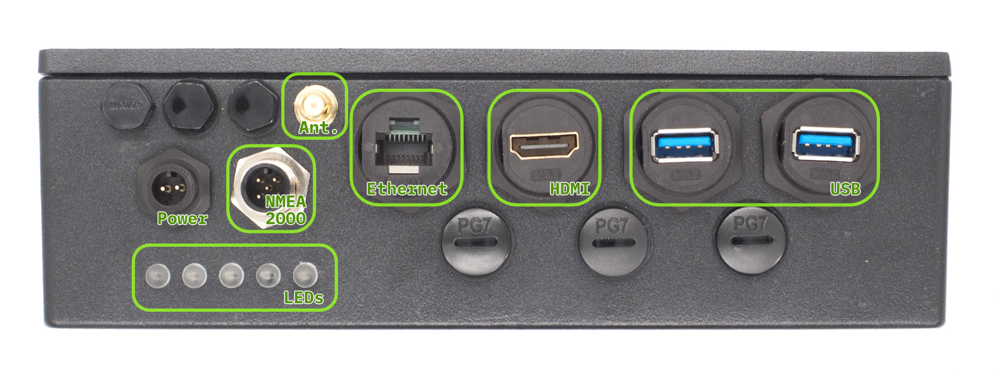
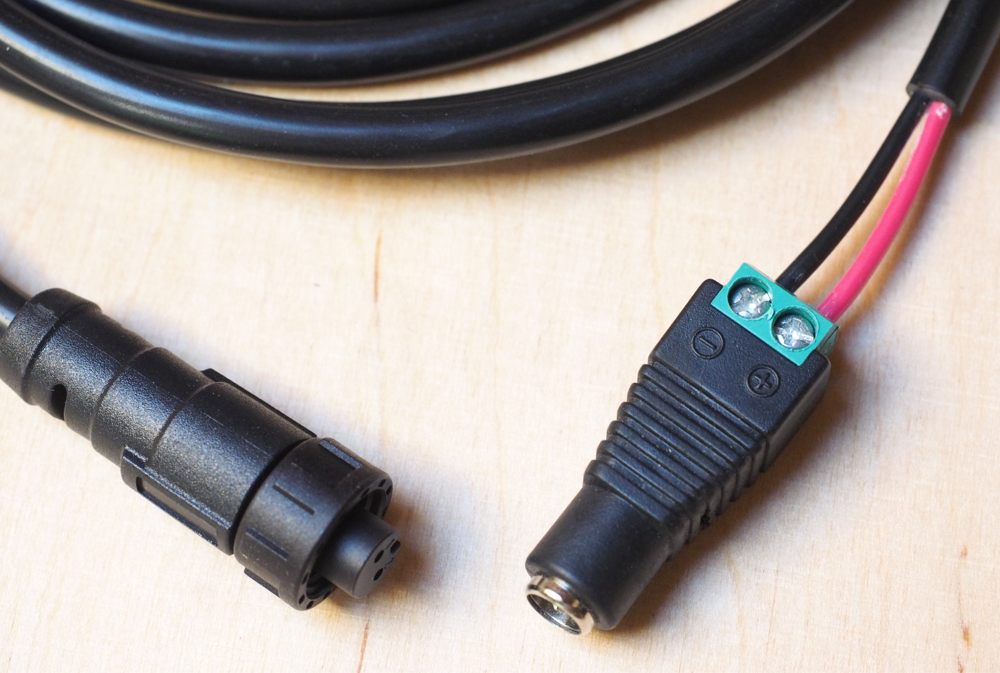
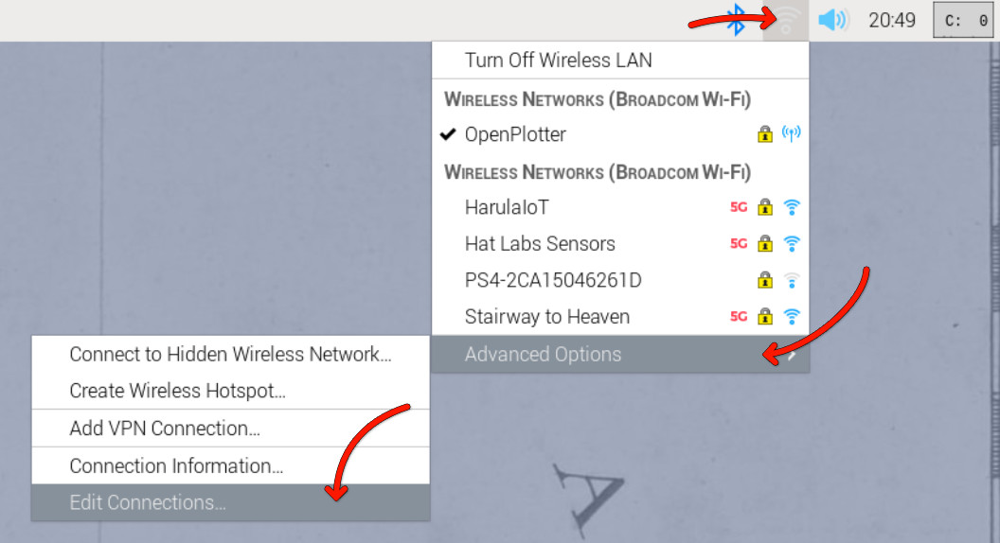
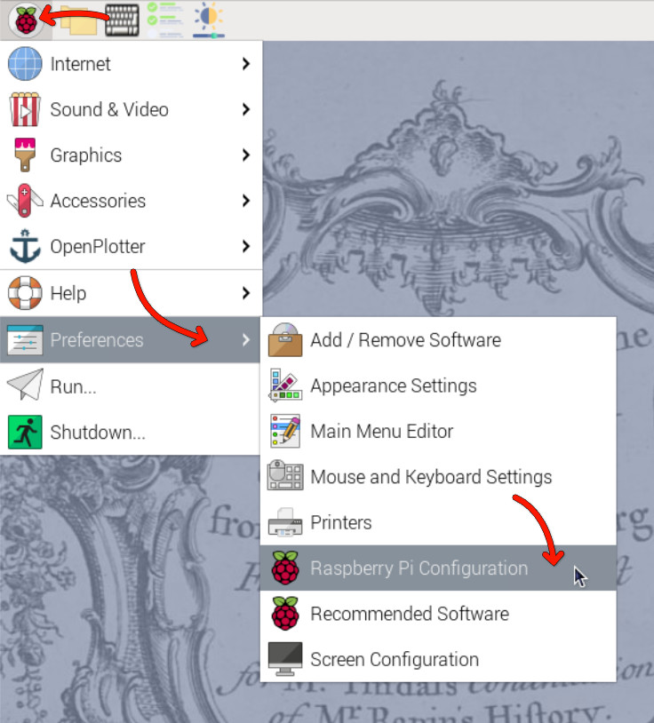
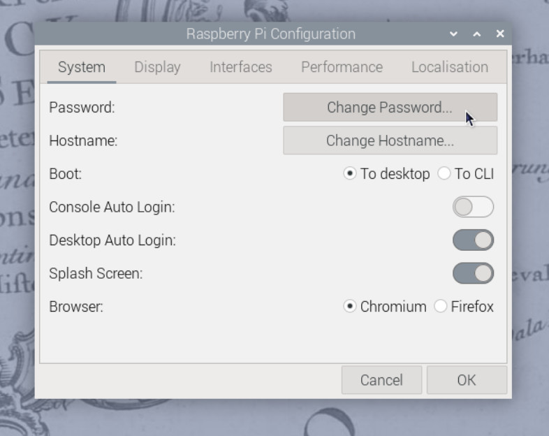

# Getting Started

This guide will get your HALPI2 up and running in under 30 minutes and covers permanent installation. Follow these steps in order for the smoothest setup experience — start with a desktop setup to verify everything works, then proceed to permanent installation.

## Safety and Handling Precautions

!!! warning "Before You Begin"
    - Ensure power is disconnected from your electrical system before making connections
    - Use appropriate fuses (3–5A) for power connections
    - Handle the unit carefully - although rugged, dropping or impact can damage internal components
    - Verify correct polarity when connecting power cables
    - Avoid static electricity discharges - ground yourself and avoid rubbing cats and amber objects before touching internal components

## What You'll Need

From your HALPI2 package:
- HALPI2 unit with pre-installed CM5 and NVMe SSD
- Power cable with E7T connector (2m length)

Optional items (included in the sales package):
- DC barrel connector pair (5.5 × 2.1 mm), when using a standard 12V "wall wart" type power supply
- Raspberry Pi WiFi/Bluetooth antenna (required if WiFi is used for initial setup)

Additional items (not included):
- 12V or 24V power source
- A separate computer for headless setup (if not using a connected display)
- Network cable (optional, for wired connection)
- Display with HDMI input (optional)
- USB keyboard and mouse (optional, for direct access)

!!! tip "Quick Tip"
    Any network device such as a router or WiFi Access Point tends to use a 12V power supply that can be used to power the HALPI2. Check your pile of old hardware for one!

## Desktop Setup

We recommend trying the HALPI2 on a desk or workbench before installing it permanently. The initial setup can be done either without a display (headless) over a network connection or with a connected display, keyboard, and mouse. A headless setup can be done either using a wired ethernet connection or the HALPI2's WiFi Access Point.

### Step 1: Connect Essential Peripherals

#### For Initial Setup:
1. **Network connection (required for headless installation):**
   - Connect Ethernet cable
   - Connect the WiFi/Bluetooth antenna

2. **Display connection (optional):**
   - Connect HDMI display for direct access
   - USB keyboard and mouse if using display


*Front Panel Connectors*

### Step 2: NMEA 2000 Connection (Optional)

If you are installing the HALPI2 directly on a boat or have a desktop NMEA 2000 installation available, you can already connect it to the NMEA 2000 network.

An [NMEA 2000 network](https://docs.hatlabs.fi/nmea2000/) consists of a backbone cable to which all devices connect using T-adapters and drop cables. Add a T-adapter to the NMEA 2000 network backbone. Connect the HALPI2's NMEA 2000 micro connector to the T-adapter using a NMEA 2000 drop cable.

### Step 3: Power Connection

!!! tip "Note on Powering with NMEA 2000"
    The HALPI2 can also be powered via the NMEA 2000 bus. See [NMEA 2000 Bus Power Connection](#nmea-2000-bus-power-connection) in the Permanent Installation section below.

For the desktop setup, we will use the provided E7T power cable. Connect the power cable wire ends to the female barrel plug as follows:
- **Red wire = Positive (+)**
- **Black wire = Negative (-)**


*An example of the E7T to barrel connector wiring*

Plug a standard 12V or 24V power supply into the barrel connector. Ensure the power supply is rated for at least 1A to handle the HALPI2's requirements.

!!! warning "Warning"
    Due to the lack of a strain relief, the screw terminal barrel connector should only be used for temporary installations. Accidental pulling on the cable can disconnect and expose the wires.

## First Boot

HALPI2 ships with a customized OpenPlotter image that includes necessary configurations and software for immediate use. If you prefer a different operating system, follow the instructions in the [Software Guide](../user-guide/software.md).

**Power on the HALPI2** by connecting the power supply if you haven't done so already. After a few seconds,
the LED bar should start filling up with red lights, indicating that the super-capacitors are charging. The LEDs will turn yellow once the system is booting, and finally green when the operating system is running and the HALPI daemon is connected to the controller.

If you have a display connected, you should see the Raspberry Pi OS splash screen, and finally, a graphical desktop will appear.

!!! tip "Tip"
    The status LED patterns are documented in the [Operation Guide](../user-guide/operation.md).

### Accessing the HALPI2 without a Display

If you do not have a display connected, you can access the HALPI2 device via the WiFi Access Point or Ethernet connection. You need to download and install RealVNC's [VNC Viewer](https://www.realvnc.com/en/connect/download/viewer/) to access the desktop remotely[^ssh].

[^ssh]: Alternatively, you can use SSH to access the command line interface. The default username is `pi` and the password is `raspberry`. The `nmtui` tool can be used to configure NetworkManager settings in the terminal.

First, wait until the LEDs turn green, indicating that the system is fully booted. Then, follow these steps:

**Option 1 - Connecting to HALPI2 via WiFi Access Point:** The HALPI2 OpenPlotter image creates a WiFi Access Point named `OpenPlotter` with the password `12345678`. Connect your computer to this network.

**Option 2 - Connecting to HALPI2 via wired Ethernet:** If you have connected the HALPI2 to your network via Ethernet, it will automatically obtain an IP address via DHCP.

You can connect to the device with VNC Viewer using the address `openplotter.local` or the assigned IP address. The username is `pi` and the password is `raspberry`.

### First Boot Configuration

!!! warning "Warning"
    The HALPI2 OpenPlotter image comes with default WiFi Access Point and user passwords. These **must** be changed during the first boot or anyone will be able to access your device.

#### Changing the Access Point Password

The WiFi access point password is changed in the network settings menu at the top right corner of the OpenPlotter desktop. Click on the network icon, then select `Advanced Options` and `Edit Connections`. Select the `OpenPlotter-Hotspot` connection and click the cogwheel icon to edit it. Change the password in the `Wireless Security` tab and save the changes.




Alternatively, if you prefer to remove the access point altogether, you can remove it using the minus button in the `Edit Connections` dialog. However, if the final installation location uses a different WiFi network, the access point may be useful for initial configuration.

#### Changing the User Password

The default user password is `raspberry`. To change it, open the Raspberry Pi menu and navigate to `Preferences` > `Raspberry Pi Configuration`. In the `System` tab, click on `Change Password` and follow the prompts.

In the Raspberry Pi Configuration tool, you can also change the hostname (the name of the device on the network) and change localization settings such as time zone and keyboard layout.





You can also change the password using the terminal by running the command:
```bash
passwd
```

!!! quote "Reference"
    Detailed OpenPlotter configuration steps are available in the [OpenPlotter documentation](https://openplotter.readthedocs.io/latest/getting_started/first_steps.html).

### Verifying NMEA 2000 Connection (Optional)

NMEA 2000 connectivity can be easiest verified by checking the Signal K server status. Open the web interface at [`http://openplotter.local:3000`](http://openplotter.local:3000), either from the HALPI2 device itself or from another device on the same network. Observe the `can0` connection activity: you should be seeing some traffic being received.


## Shutting Down the Device

The HALPI2 is designed to shut down automatically when disconnected from the power supply. When you need to shut down the device, simply cut the power, either using an electrical panel switch or disconnecting the power connector. The system will automatically initiate a software shutdown sequence, ensuring that all applications close properly and the filesystem is safely unmounted.

If you choose to shut down the system using the desktop interface or command-line tools (such as the `shutdown` command), the device will automatically restart after approximately 5 seconds. This behavior is due to the power management system detecting that external power is still available.

During the shutdown process, you can monitor the system status through the LED indicators on the front panel. When power is initially cut, the green LEDs will dim to indicate a blackout condition. After 5 seconds, the LEDs will change to violet, providing a clear visual indication that the device is actively shutting down. Once the shutdown process is complete, all LEDs will turn off.

The shutdown process typically takes only a few seconds under normal conditions. However, in some cases, certain services may require additional time to stop properly. If this occurs, the device may deplete the super-capacitors almost completely before shutting down. This extended shutdown time is normal behavior and does not indicate a fault with the system.

## Troubleshooting Quick Start Issues

### Common and Uncommon Issues:

❌ **No power/LEDs:**
- Verify power connections and polarity
- Check fuse condition
- Ensure voltage is within 11-32V range

❌ **WiFi Access Point not visible:**
- Ensure antenna is properly connected
- Try to connect using a different device
- Check if the HALPI2 is fully booted (LEDs should be green)
- Try connecting via Ethernet first

❌ **Cannot access the device using `openplotter.local`:**
- There may be another device on the network with the same hostname
- Try using the assigned IP address instead (check your router's DHCP client list)

❌ **Display connected but not showing anything:**
- Ensure HDMI cable is securely connected
- Ensure the display is powered on and set to the correct input
- Try a different HDMI cable or port on the display
- Make sure the HALPI2 is on (LEDs should be yellow or green)
- If the LEDs are flashing in a rainbow pattern, the Compute Module 5 is not properly seated. This may be due to transportation damage. Follow the instructions in the [User Guide](../user-guide/operation.md) to reseat the CM5 or contact support for assistance.

❌ **Connected display is showing an error message about 'nvme':**
- This indicates the NVMe SSD is not detected or not properly initialized. This can be due to transportation damage. Follow the instructions in the [User Guide](../user-guide/operation.md) to reseat the NVMe SSD or contact support for assistance.

### Getting Help:

- **Documentation:** Refer to specific sections for detailed troubleshooting
- **Community:** Join the Hat Labs community forums
- **Support:** Contact technical support for hardware issues

---

## Permanent Installation

Once you've verified everything works on your desk, follow these steps for permanent mounting and wiring.

### Planning Your Installation

!!! tip "Quick Tip"
    Take photos of your existing wiring before making changes - it helps when troubleshooting later.

Take time to plan your installation. Consider:

- **Mounting location** - accessibility, protection, ventilation
- **Cable routing** - shortest runs, protection from damage
- **Power source** - dedicated circuit vs. shared, fusing requirements
- **Network integration** - NMEA 2000, Ethernet, WiFi coverage
- **Environmental factors** - temperature, moisture, vibration

#### Required Tools and Materials

**Tools:**
- Drill with bits
- Screwdriver set (PH2 Phillips, large flathead)
- Wire strippers and crimpers for power connections
- Multimeter for testing
- Heat gun or lighter (for heat-shrink tubing)

**Materials (not included):**
- Mounting screws (4mm or M4, depending on the mounting surface)
- Appropriate fuses (3-5A) or respectively rated electrical panel circuit breakers
- Marine-grade wire (1.5mm² or 16 AWG for power if the provided cable is too short)
- Heat-shrink tubing and terminals
- Cable ties and mounting clips

### Mounting

#### Location Selection

Choose a mounting location that provides:

!!! tip "Optimal Mounting Conditions"
    - **Temperature range:** -20°C to +60°C ambient
    - **Ventilation:** Sufficient clearance around enclosure
    - **Protection:** Away from direct water spray and mechanical damage
    - **Access:** Easy access to connectors and status LEDs
    - **Support:** Solid mounting surface capable of supporting 2kg + cables
    - **Space:** Allow at least 100mm clearance in front of the panel connectors for cable management.

Even though this guide focuses on fixed installations, in practice it is often sufficient to place the device on a shelf or tabletop, provided it is stable and protected from moisture and impact.

#### Environmental Guidelines

**Marine Installations:**
- Mount above expected bilge water level
- Avoid areas with direct spray or standing water
- Consider boat movement and vibration, and secure all connections
- Use corrosion-resistant mounting hardware

**Automotive Installations:**
- Protect from engine heat and vibration
- Ensure adequate ventilation in enclosed spaces
- Consider accessibility for maintenance
- Use vibration-resistant mounting

**Industrial Installations:**
- Protect from process chemicals and extreme temperatures
- Consider electromagnetic interference sources
- Ensure compliance with local electrical codes
- Plan for routine maintenance access

#### Mounting Orientation

!!! info "Recommended Orientation"
    **Preferred:** Connectors facing downward

    - Reduces water ingress risk
    - Improves cable management
    - Easier access for maintenance

    **Acceptable:** Connectors facing sideways

    - Ensure adequate drainage
    - Use cable entry seals

    **Avoid:** Connectors facing upward

    - Increases water ingress risk
    - Makes cable management difficult

#### Mounting Steps

##### Step 0: Download and Print the Mounting Template

Download the [HALPI2 Mounting Template](./HALPI2_enclosure_1B_Drill_Template_v2.pdf) and print it at 100% scale. This template will help you mark the mounting holes accurately. If you don't have access to a printer, you can also use the dimensions provided in the template to mark the holes manually, or use the enclosure itself to mark the holes directly on your mounting surface.

[](./HALPI2_enclosure_1B_Drill_Template_v2.pdf)

##### Step 1: Prepare the Mounting Surface

1. **Clean the mounting surface**
2. **Mark mounting holes** using the printed template
3. **Test fit** the enclosure before installation
4. **Drill pilot holes** for mounting screws

##### Step 2: Install the HALPI2

1. **Position the enclosure** with connectors in preferred orientation
2. **Drive mounting screws** - snug but do not over-torque

### Permanent Power Installation

#### Power Source Selection

**Option 1: Dedicated Power Connector**
- Most reliable and flexible
- Supports full power capability
- Easier maintenance and troubleshooting

**Option 2: NMEA 2000 Bus Power**
- Simplifies wiring in marine installations
- Limited to 0.9A current draw
- Requires careful attention to voltage drop

#### Current Limiting Configuration

HALPI2 includes a built-in input current limiter that manages the initial super-capacitor charging and protects the installation from overcurrent conditions. The current limit can be set to either 0.9A or 2.5A, depending on your power source and application requirements. The default setting of 0.9A is suitable for most applications.

If you want to increase the initial start-up speed or need to power high-current peripherals, you can switch to the 2.5A setting. Follow the steps outlined in the [User Guide](../user-guide/operation.md) to change the current limit setting.

#### Dedicated Power Connection

##### Cable Preparation

1. **Route the power cable** from HALPI2 to power source
2. **Allow service loops** at both ends
3. **Protect cable** from chafing and damage
4. **Trim to length** leaving adequate working room

##### Connection at Power Source

1. **Ensure wire protection** by allocating a 3-5A circuit breaker or installing an inline fuse
2. **Strip wire ends** to appropriate length
3. **Install terminals** using proper crimping technique
4. **Connect to power source:**
   - **Red wire:** Positive (+) terminal
   - **Black wire:** Negative (-) terminal
5. **Verify polarity** with multimeter before energizing

##### Connection at HALPI2

The E7T connector is pre-wired and requires no field termination. Simply plug into the HALPI2 power socket.

#### NMEA 2000 Bus Power Connection

!!! info "Prerequisites"
    - Current limit switch **must** be set to 0.9A
    - NMEA 2000 network must have adequate power capacity
    - Drop cable should be close to power feed to minimize voltage drop

##### Required Components

- NMEA 2000 drop cable (not included)
- T-connector for backbone integration (not included)

##### Installation Steps

1. **Power down** all NMEA 2000 devices
2. **Open HALPI2 enclosure** (see [User Guide](../user-guide/operation.md) for instructions)
3. **Locate the carrier board power connector**
4. **Unplug existing terminal block**
5. **Connect the internal NMEA 2000 power terminal block** to the carrier board power connector
6. **Verify current limit** is set to 0.9A
7. **Connect to backbone** using appropriate drop cable and T-connector
8. **Test installation** before final closure
9. **Reassemble enclosure**


*To power HALPI2 over NMEA 2000, unplug terminal block 1 and replace it with terminal block 2.*

### Network and Data Connections

#### NMEA 2000 Data Connection

Even when using a dedicated power connection, you may want NMEA 2000 data connectivity:

1. **Install T-connector** on NMEA 2000 backbone
2. **Connect drop cable** between T-connector and HALPI2
3. **Verify proper termination** of NMEA 2000 network
4. **Test connectivity** after installation

#### Ethernet Connection

For network connectivity:

1. **Use marine-grade** or appropriate environment-rated cable
2. **Install cable glands or cable grommets** if routing through bulkheads
3. **Provide service loops** at both ends
4. **Test connectivity** before final installation

#### WiFi/Bluetooth Antenna

1. **Install antenna** on RP-SMA connector
2. **Position for optimal coverage** - away from metal obstructions. In metal cabinets, a male to female RP-SMA extension cable may be required.
3. **Test signal strength** in final position

### Troubleshooting Installation Issues

#### Power Problems

❌ **No power indication:**
- Check fuse condition and rating
- Verify power source voltage (11-32V)
- Confirm correct polarity
- Test continuity of power cables

❌ **Intermittent power:**
- Check all connection tightness
- Inspect for corroded terminals
- Verify adequate wire gauge for current

#### Network Connectivity

❌ **No NMEA 2000 communication:**
- Verify network termination (120Ω at both ends)
- Check T-connector installation
- Confirm drop cable integrity
- Test with known-good device

❌ **No Ethernet connectivity:**
- Test cable with cable tester
- Verify switch/router configuration
- Check for IP address conflicts
- Confirm cable rating (Cat5e minimum)

#### Environmental Issues

❌ **Moisture ingress:**
- Inspect all seal conditions
- Verify connector orientation
- Check cable entry points
- Consider additional protection

❌ **Overheating:**
- Move away from heat sources
- Check for obstructed airflow around enclosure

### Safety and Compliance

#### Electrical Safety

- **Use appropriate fuses** for overcurrent protection
- **Ensure proper grounding** per local codes
- **Protect against short circuits** with proper routing

#### Marine Installations

- **Follow local or ABYC standards** for electrical installations
- **Use marine-grade components** throughout

#### Industrial Installations

- **Comply with local electrical codes**
- **Ensure proper EMI/RFI** protection
- **Document installation** per facility requirements

## Next Steps

Once your HALPI2 is running:

1. **Explore the [User Guide](../user-guide/operation.md)** for detailed operation instructions
2. **Review Common Use Cases** for application-specific setup
3. **Check out the Technical Reference** for advanced configuration options
4. **Join the community** for tips, tricks, and support
