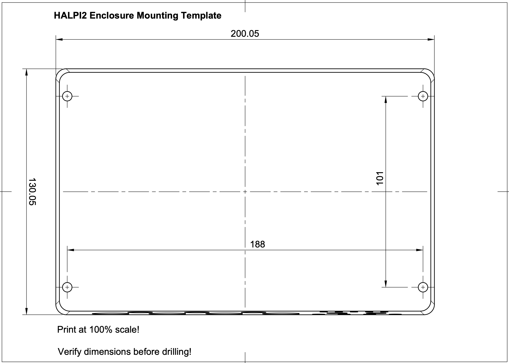

# Installation Guide

This guide covers permanent installation of your HALPI2 in different environments.

## Before You Begin

### Planning Your Installation

> 💡 **Quick Tip:** Take photos of your existing wiring before making changes - it helps when troubleshooting later.

Take time to plan your installation. Consider:

- **Mounting location** - accessibility, protection, ventilation
- **Cable routing** - shortest runs, protection from damage
- **Power source** - dedicated circuit vs. shared, fusing requirements
- **Network integration** - NMEA 2000, Ethernet, WiFi coverage
- **Environmental factors** - temperature, moisture, vibration

### Required Tools and Materials

**Tools:**
- Drill with bits
- Screwdriver set (PH2 Phillips, large flathead)
- Wire strippers and crimpers for power connections
- Multimeter for testing
- Heat gun or lighter (for heat-shrink tubing)

**Materials (not included):**
- Mounting screws (4mm or M4, depending on the mounting surface)
- Appropriate fuses (3-5A) or respectively rated electrical panel circuit breakers
- Marine-grade wire (1.5mm² or 16 AWG for power if the provided cable is too short)
- Heat-shrink tubing and terminals
- Cable ties and mounting clips

## Mounting Considerations

### Location Selection

Choose a mounting location that provides:

> 💡 **Optimal Mounting Conditions**
>
> - **Temperature range:** -20°C to +60°C ambient
> - **Ventilation:** Sufficient clearance around enclosure
> - **Protection:** Away from direct water spray and mechanical damage
> - **Access:** Easy access to connectors and status LEDs
> - **Support:** Solid mounting surface capable of supporting 2kg + cables
> - **Space:** Allow at least 100mm clearance in front of the panel connectors for cable management.

Even though this guide focuses on fixed installations, in practice it is often sufficient to place the device on a shelf or tabletop, provided it is stable and protected from moisture and impact.

### Environmental Guidelines

**Marine Installations:**
- Mount above expected bilge water level
- Avoid areas with direct spray or standing water
- Consider boat movement and vibration, and secure all connections
- Use corrosion-resistant mounting hardware

**Automotive Installations:**
- Protect from engine heat and vibration
- Ensure adequate ventilation in enclosed spaces
- Consider accessibility for maintenance
- Use vibration-resistant mounting

**Industrial Installations:**
- Protect from process chemicals and extreme temperatures
- Consider electromagnetic interference sources
- Ensure compliance with local electrical codes
- Plan for routine maintenance access

### Mounting Orientation

> 🔧 **Recommended Orientation**
>
> **Preferred:** Connectors facing downward
> - Reduces water ingress risk
> - Improves cable management
> - Easier access for maintenance
>
> **Acceptable:** Connectors facing sideways
> - Ensure adequate drainage
> - Use cable entry seals
>
> **Avoid:** Connectors facing upward
> - Increases water ingress risk
> - Makes cable management difficult

## Physical Installation

### Step 0: Download and Print the Mounting Template

Download the [HALPI2 Mounting Template](./HALPI2_enclosure_1B_Drill_Template_v2.pdf) and print it at 100% scale. This template will help you mark the mounting holes accurately. If you don't have access to a printer, you can also use the dimensions provided in the template to mark the holes manually, or use the enclosure itself to mark the holes directly on your mounting surface.

### Step 1: Prepare the Mounting Surface

1. **Clean the mounting surface**
2. **Mark mounting holes** using the printed template
3. **Test fit** the enclosure before installation
4. **Drill pilot holes** for mounting screws

### Step 2: Install the HALPI2

1. **Position the enclosure** with connectors in preferred orientation
2. **Drive mounting screws** - snug but do not over-torque

## Power Installation

### Power Source Selection

**Option 1: Dedicated Power Connector**
- Most reliable and flexible
- Supports full power capability
- Easier maintenance and troubleshooting

**Option 2: NMEA 2000 Bus Power**
- Simplifies wiring in marine installations
- Limited to 0.9A current draw
- Requires careful attention to voltage drop

### Current Limiting Configuration

HALPI2 includes a built-in input current limiter that manages the initial super-capacitor charging and protects the installation from overcurrent conditions. The current limit can be set to either 0.9A or 2.5A, depending on your power source and application requirements. The default setting of 0.9A is suitable for most applications.

If you want to increase the initial start-up speed or need to power high-current peripherals, you can switch to the 2.5A setting. Follow the steps outlined in the [User Guide](../user-guide/operation.md) to change the current limit setting.

### Dedicated Power Connection

#### Cable Preparation

1. **Route the power cable** from HALPI2 to power source
2. **Allow service loops** at both ends
3. **Protect cable** from chafing and damage
4. **Trim to length** leaving adequate working room

#### Connection at Power Source

1. **Ensure wire protection** by allocating a 3-5A circuit breaker or installing an inline fuse
2. **Strip wire ends** to appropriate length
3. **Install terminals** using proper crimping technique
4. **Connect to power source:**
   - **Red wire:** Positive (+) terminal
   - **Black wire:** Negative (-) terminal
5. **Verify polarity** with multimeter before energizing

#### Connection at HALPI2

The E7T connector is pre-wired and requires no field termination. Simply plug into the HALPI2 power socket.

### NMEA 2000 Bus Power Connection

> 🔧 **Prerequisites**
>
> - Current limit switch **must** be set to 0.9A
> - NMEA 2000 network must have adequate power capacity
> - Drop cable should be close to power feed to minimize voltage drop

#### Required Components

- NMEA 2000 drop cable (not included)
- T-connector for backbone integration (not included)

#### Installation Steps

1. **Power down** all NMEA 2000 devices
2. **Open HALPI2 enclosure** (see [User Guide](../user-guide/operation.md) for instructions)
3. **Locate the carrier board power connector**
4. **Unplug existing terminal block**
5. **Connect the internal NMEA 2000 power terminal block** to the carrier board power connector
6. **Verify current limit** is set to 0.9A
7. **Connect to backbone** using appropriate drop cable and T-connector
8. **Test installation** before final closure
9. **Reassemble enclosure**

*To power HALPI2 over NMEA 2000, unplug terminal block 1 and replace it with terminal block 2.*

## Network and Data Connections

### NMEA 2000 Data Connection

Even when using a dedicated power connection, you may want NMEA 2000 data connectivity:

1. **Install T-connector** on NMEA 2000 backbone
2. **Connect drop cable** between T-connector and HALPI2
3. **Verify proper termination** of NMEA 2000 network
4. **Test connectivity** after installation

### Ethernet Connection

For network connectivity:

1. **Use marine-grade** or appropriate environment-rated cable
2. **Install cable glands or cable grommets** if routing through bulkheads
3. **Provide service loops** at both ends
4. **Test connectivity** before final installation

### WiFi/Bluetooth Antenna

1. **Install antenna** on RP-SMA connector
2. **Position for optimal coverage** - away from metal obstructions. In metal cabinets, a male to female RP-SMA extension cable may be required.
3. **Test signal strength** in final position

## Troubleshooting Installation Issues

### Power Problems

❌ **No power indication:**
- Check fuse condition and rating
- Verify power source voltage (11-32V)
- Confirm correct polarity
- Test continuity of power cables

❌ **Intermittent power:**
- Check all connection tightness
- Inspect for corroded terminals
- Verify adequate wire gauge for current

### Network Connectivity

❌ **No NMEA 2000 communication:**
- Verify network termination (120Ω at both ends)
- Check T-connector installation
- Confirm drop cable integrity
- Test with known-good device

❌ **No Ethernet connectivity:**
- Test cable with cable tester
- Verify switch/router configuration
- Check for IP address conflicts
- Confirm cable rating (Cat5e minimum)

### Environmental Issues

❌ **Moisture ingress:**
- Inspect all seal conditions
- Verify connector orientation
- Check cable entry points
- Consider additional protection

❌ **Overheating:**
- Move away from heat sources
- Check for obstructed airflow around enclosure

## Safety and Compliance

### Electrical Safety

- **Use appropriate fuses** for overcurrent protection
- **Ensure proper grounding** per local codes
- **Protect against short circuits** with proper routing

### Marine Installations

- **Follow local or ABYC standards** for electrical installations
- **Use marine-grade components** throughout

### Industrial Installations

- **Comply with local electrical codes**
- **Ensure proper EMI/RFI** protection
- **Document installation** per facility requirements

---

🎉 **Installation Complete!**

Your HALPI2 is now permanently installed and ready for long-term operation.
