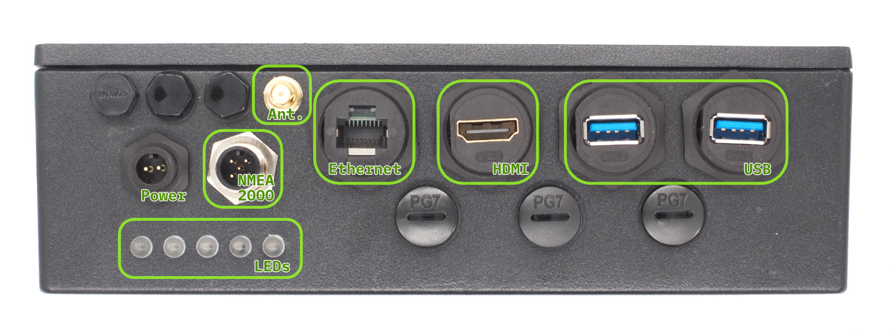
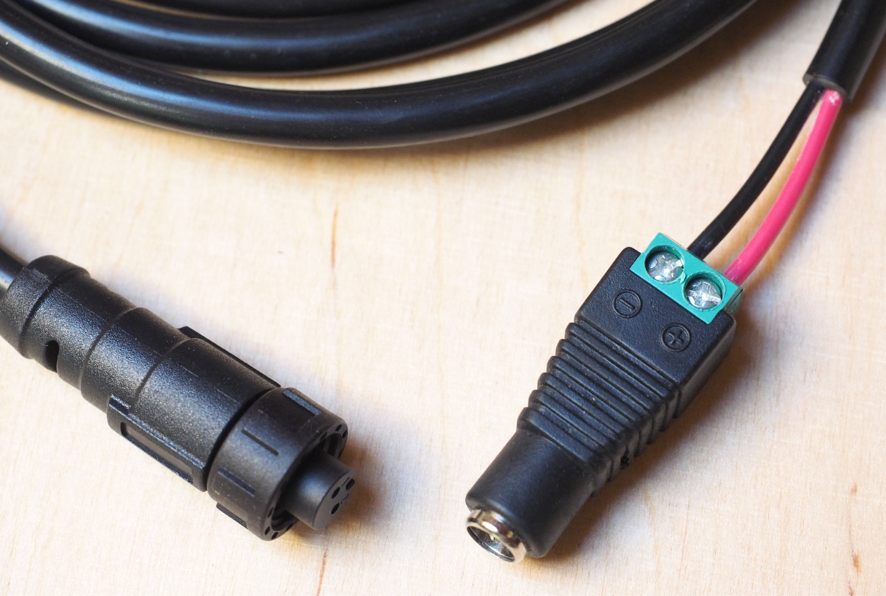
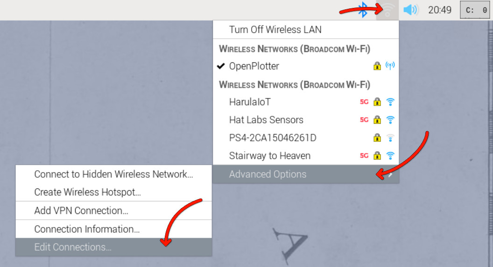
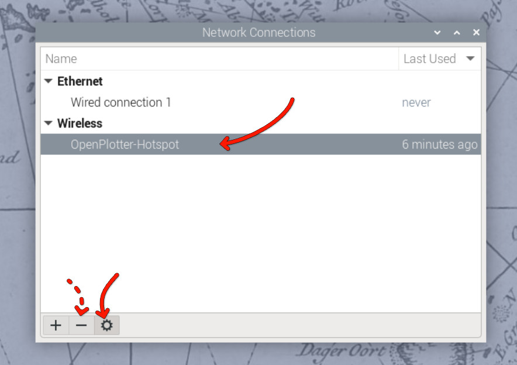
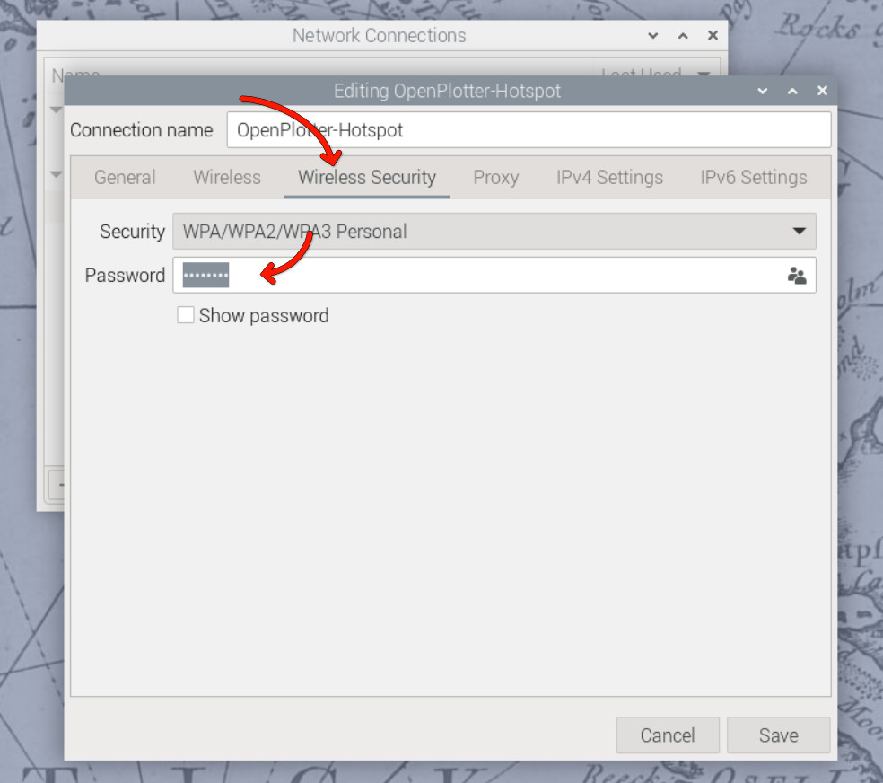
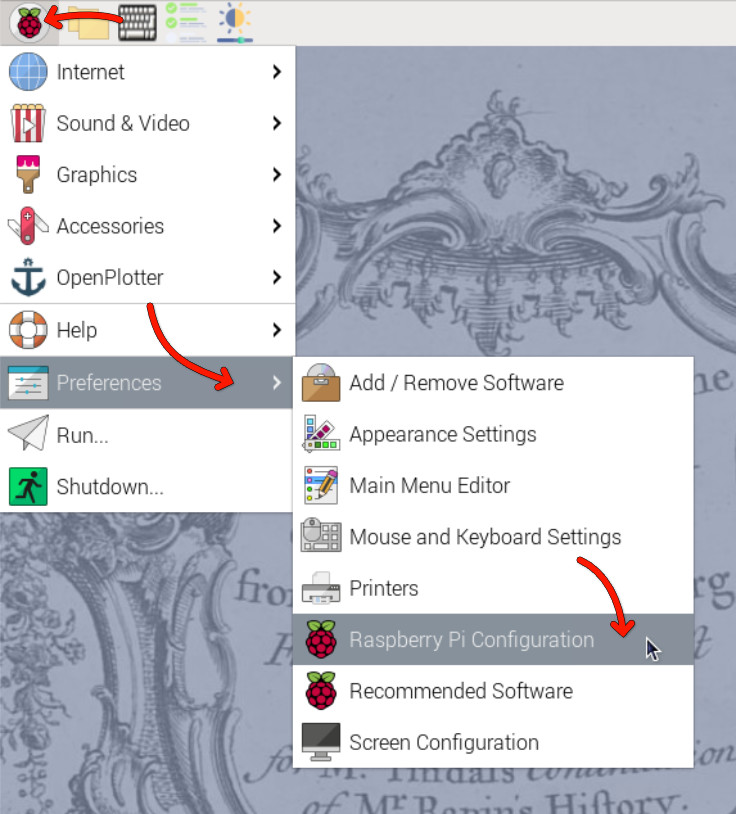
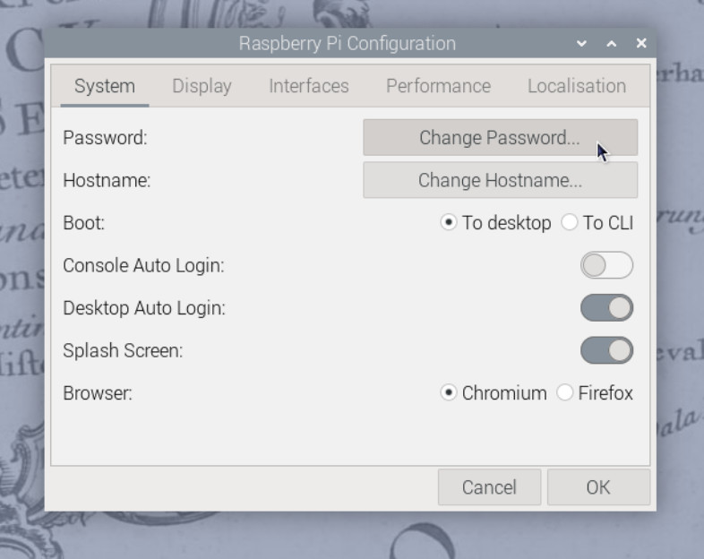
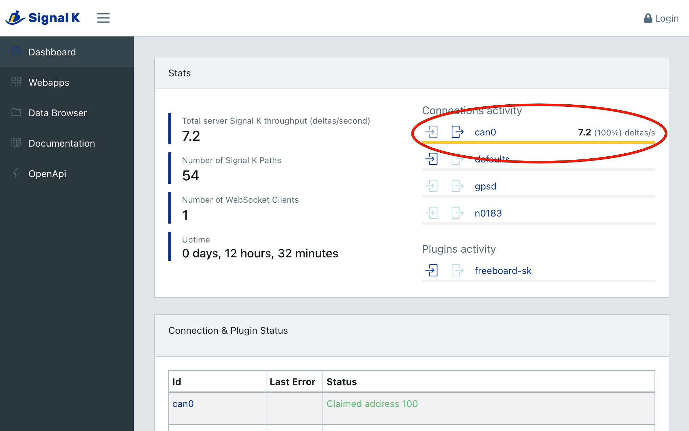

# Quick Start Guide

This guide will get your HALPI2 up and running in under 30 minutes. Follow these steps in order for the smoothest setup experience. You can follow these steps at home and bring the unit to your boat or vehicle later for permanent installation.

## Safety and Handling Precautions

> ⚠️ **Before You Begin**<br>
> - Ensure power is disconnected from your electrical system before making connections
> - Use appropriate fuses (3A or 5A) for power connections
> - Handle the unit carefully - although rugged, dropping or impact can damage internal components
> - Verify correct polarity when connecting power cables
> - Avoid static electricity discharges - ground yourself and avoid rubbing cats and amber objects before touching internal components

## What You'll Need

From your HALPI2 package:
- HALPI2 unit with pre-installed CM5 and NVMe SSD
- Power cable with E7T connector (2m length)
- DC barrel connector pair (5.5 × 2.1 mm)
- Raspberry Pi antenna

Additional items (not included):
- 12V or 24V power source
- Network cable (optional, for wired connection)
- Display with HDMI input (optional)
- USB keyboard and mouse (optional, for direct access)

> 💡 **Quick Tip**
>
> Any network device such as a router or WiFi Access Point tends to use a 12V power supply that can be used to power the HALPI2. Check your pile of old hardware for one!

## Hardware Setup

This quick start guide assumes you will be trying the HALPI2 on a desk or workbench before installing it on your boat or vehicle. For permanent installation, refer to the [Installation Guide](./installation.md).

### Step 1: Connect Essential Peripherals

#### For Initial Setup:
1. **Network connection (recommended):**
   - Connect Ethernet cable to access web interface
   - Or use WiFi Access Point (see Software Setup)

2. **Display connection (optional):**
   - Connect HDMI display for direct access
   - USB keyboard and mouse if using display

3. **Antenna connection:**
   - Attach provided WiFi/Bluetooth antenna to the RP-SMA connector
   - Ensure secure connection for proper wireless performance


*Front Panel Connectors*

### Step 2: NMEA 2000 Connection (Optional)

Add a T-adapter to the NMEA 2000 network backbone. Connect the HALPI2's NMEA 2000 micro connector to the T-adapter using a NMEA 2000 drop cable. This allows the HALPI2 to communicate with other NMEA 2000 devices on the network.


### Step 3: Power Connection

#### On a Desk or Workbench

> ⚠️ **Warning**
>
> Due to the lack of a strain relief, the screw terminal barrel connector should only be used for temporary installations. Accidental pulling on the cable can disconnect and expose the wires.

For the quick start, we will use the provided E7T power cable. Connect the power cable wire ends to the female barrel plug as follows:
- **Red wire = Positive (+)**
- **Black wire = Negative (-)**


*An example of the E7T to barrel connector wiring*

Plug a standard 12V or 24V power supply into the barrel connector. Ensure the power supply is rated for at least 1A to handle the HALPI2's requirements.

#### On a Boat or Vehicle

If you want to perform the initial setup in the final location, ensure all connections are secure and follow the guidelines in the [Installation Guide](./installation.md) for proper mounting and wiring practices.

## First Boot

HALPI2 ships with a customized OpenPlotter image that includes necessary configurations and software for immediate use. If you prefer a different operating system, follow the instructions in the [Software Setup section](../user-guide/software-setup.md).

**Power on the HALPI2** by connecting the power supply if you haven't done so already. After a few seconds,
the LED bar should start filling up with red lights, indicating that the super-capacitors are charging. The LEDs will turn yellow once the system is booting, and finally green when the operating system is running and the HALPI daemon is connected to the controller.

If you have a display connected, you should see the Raspberry Pi OS splash screen, and finally, a graphical desktop will appear.

### Accessing the HALPI2 without a Display

If you do not have a display connected, you can access the HALPI2 device via the WiFi Access Point or Ethernet connection. You need to download and install RealVNC's [VNC Viewer](https://www.realvnc.com/en/connect/download/viewer/) to access the desktop remotely[^ssh].

[^ssh]: Alternatively, you can use SSH to access the command line interface. The default username is `pi` and the password is `raspberry`. The `nmtui` tool can be used to configure NetworkManager settings in the terminal.

First, wait until the LEDs turn green, indicating that the system is fully booted. Then, follow these steps:

**Option 1 - Connecting to HALPI2 via WiFi Access Point:** The HALPI2 OpenPlotter image creates a WiFi Access Point named `OpenPlotter` with the password `12345678`. Connect your computer to this network.

**Option 2 - Connecting to HALPI2 via wired Ethernet:** If you have connected the HALPI2 to your network via Ethernet, it will automatically obtain an IP address via DHCP.

You can connect to the device with VNC Viewer using the address `openplotter.local` or the assigned IP address. The username is `pi` and the password is `raspberry`.

### First Boot Configuration

> ⚠️ **Warning**
>
> The HALPI2 OpenPlotter image comes with default WiFi Access Point and user passwords. These **must** be changed during the first boot or anyone will be able to access your device.

#### Changing the Access Point Password

The WiFi access point password is changed in the network settings menu at the top right corner of the OpenPlotter desktop. Click on the network icon, then select `Advanced Options` and `Edit Connections`. Select the `OpenPlotter-Hotspot` connection and click the cogwheel icon to edit it. Change the password in the `Wireless Security` tab and save the changes.







Alternatively, if you prefer to remove the access point altogether, you can remove it using the minus button in the `Edit Connections` dialog. However, if the final installation location uses a different WiFi network, the access point may be useful for initial configuration.

#### Changing the User Password

The default user password is `raspberry`. To change it, open the Raspberry Pi menu and navigate to `Preferences` > `Raspberry Pi Configuration`. In the `System` tab, click on `Change Password` and follow the prompts.

In the Raspberry Pi Configuration tool, you can also change the hostname (the name of the device on the network) and change localization settings such as time zone and keyboard layout.





You can also change the password using the terminal by running the command:
```bash
passwd
```

> 📖 **Reference**
>
> Detailed OpenPlotter configuration steps are available in the [OpenPlotter documentation](https://openplotter.readthedocs.io/latest/getting_started/first_steps.html).

### Verifying NMEA 2000 Connection (Optional)

NMEA 2000 connectivity can be easiest verified by checking the Signal K server status. Open the web interface at [`http://openplotter.local:3000`](http://openplotter.local:3000), either from the HALPI2 device itself or from another device on the same network. Observe the `can0` connection activity: you should be seeing some traffic being received.



## Troubleshooting First Boot

### Common and Uncommon Issues:

❌ **No power/LEDs:**
- Verify power connections and polarity
- Check fuse condition
- Ensure voltage is within 11-32V range

❌ **WiFi Access Point not visible:**
- Ensure antenna is properly connected
- Try to connect using a different device
- Check if the HALPI2 is fully booted (LEDs should be green)
- Try connecting via Ethernet first

❌ **Cannot access the device using `openplotter.local`:**
- There may be another device on the network with the same hostname
- Try using the assigned IP address instead (check your router's DHCP client list)

❌ **Display connected but not showing anything:**
- Ensure HDMI cable is securely connected
- Ensure the display is powered on and set to the correct input
- Try a different HDMI cable or port on the display
- Make sure the HALPI2 is on (LEDs should be yellow or green)
- If the LEDs are flashing in a rainbow pattern, the Compute Module 5 is not properly seated. This may be due to transportation damage. Follow the instructions in the [User Guide](../user-guide/operation.md) to reseat the CM5 or contact support for assistance.

❌ **Connected display is showing an error message about 'nvme':**
- This indicates the NVMe SSD is not detected or not properly initialized. This can be due to transportation damage. Follow the instructions in the [User Guide](../user-guide/operation.md) to reseat the NVMe SSD or contact support for assistance.

### Getting Help:

- **Documentation:** Refer to specific sections for detailed troubleshooting
- **Community:** Join the Hat Labs community forums
- **Support:** Contact technical support for hardware issues

## Next Steps

Follow the [Installation Guide](./installation.md) for permanent mounting and wiring, or continue with the [Software Setup](../user-guide/software-setup.md) to configure your HALPI2 for your specific use case.

Once your HALPI2 is running:

1. **Explore the User Guide** for detailed operation instructions
2. **Review Common Use Cases** for application-specific setup
3. **Check out the Technical Reference** for advanced configuration options
4. **Join the community** for tips, tricks, and support

🎉 **Congratulations!** Your HALPI2 is now ready for use. The system is designed for 24/7 operation and will provide reliable service in demanding environments.
