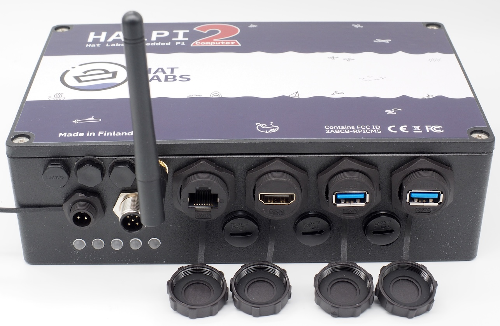

# Introduction

HALPI2 is a pre-built, ready-to-use boat computer based on the Raspberry Pi
Compute Module 5 (CM5). Powered by the same System-on-Chip (SoC) as the Raspberry
Pi 5, it is fully compatible with all Raspberry Pi software as well as many
hardware add-ons. Additionally, it offers a comprehensive set of features ideally suited
for marine, automotive, and industrial applications.

Enclosure features include:

- Waterproof (IP65) aluminium enclosure, size 200x130x60 mm
- Standard connectors for power, NMEA 2000, gigabit ethernet, HDMI, and 2x USB 3.0
- Connector options for 3x PG7 cable glands or SP13 waterproof connectors and
  2x SMA connectors for external antennas

Hardware features include:

- Power supply accepts voltages from 10 to 32 VDC and can withstand voltages up to
  100 VDC without damage
- Input current limited to 0.9 or 2.5 A (user-selectable)
- Can be powered from a 12 V or 24 V battery or via NMEA 2000
- Includes super-capacitors for short-term backup power - ideal for intermittent
  and "dirty" power sources
- Detects power loss and can initiate a controlled shutdown
- CM5 module in contact with the enclosure for passive cooling
- Accepts standard M.2 NVMe SSD disks for fast storage
- Standard Raspberry Pi 40-pin GPIO header for additional hardware add-ons
- Carrier board includes 2x HDMI, 2x MIPI (DSI/CSI), 4x USB 3.0, gigabit ethernet,
  CAN-FD (NMEA 2000) and RS-485 (NMEA 0183) interfaces, and a real-time clock
  backup battery
- Five RGB LEDs for status indication
- User-configurable button headers for custom functions

Software features include:

- Carrier board controller communicates with the CM5 via I2C
- Host daemon software can monitor voltage levels, current consumption, and
  temperatures of the CM5 and carrier board
- Supports transparent firmware updates over I2C
- Usable without the daemon software, with reduced functionality

This user guide provides information on how to set up and use HALPI2 as well as
information on the hardware and software features.
