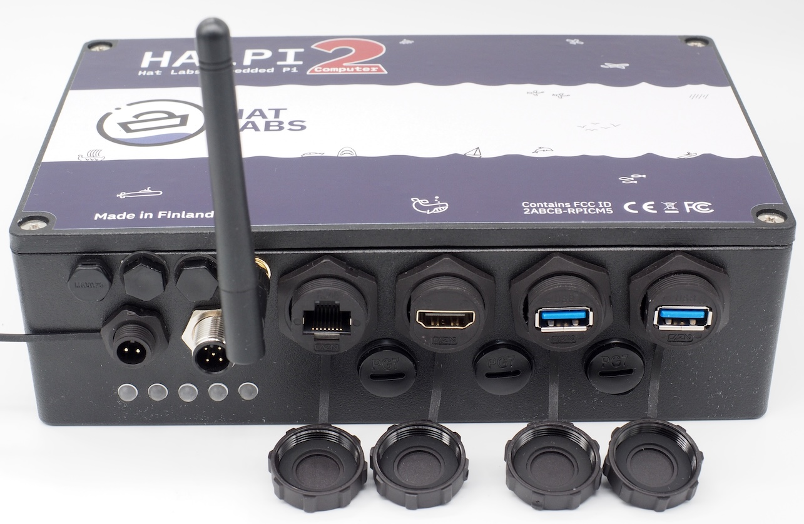

# Introduction

HALPI2 is a pre-built, ready-to-use boat computer based on the Raspberry Pi Compute Module 5 (CM5). Powered by the same System-on-Chip (SoC) as the Raspberry Pi 5, it is fully compatible with all Raspberry Pi software as well as many hardware add-ons. Additionally, it offers a comprehensive set of features ideally suited for marine, automotive, and industrial applications.

## What is HALPI2?

HALPI2 represents the latest evolution in rugged embedded computing, combining the power and ecosystem of Raspberry Pi with specialized features for demanding environments. Unlike standard single-board computers, HALPI2 is engineered from the ground up for 24/7 operation in harsh conditions where reliability is paramount.

The system integrates a Raspberry Pi Compute Module 5 with a custom carrier board, all housed in a waterproof aluminum enclosure that doubles as a heat sink. This design provides the computational power needed for modern applications while maintaining the robustness required for marine and industrial use.

## Key Features and Capabilities

### Enclosure Features
- **Waterproof (IP65) aluminum enclosure**, size 200×130×60 mm
- **Standard connectors** for power, NMEA 2000, gigabit ethernet, HDMI, and 2× USB 3.0
- **Flexible connectivity** with options for 3× PG7 cable glands or SP13 waterproof connectors
- **External antenna support** via 2× SMA connectors
- **Wall-mount design** with connectors positioned for easy installation

### Hardware Features
- **Wide input voltage range** from 10 to 32 VDC with protection up to 100 VDC
- **Intelligent current limiting** (0.9 or 2.5 A user-selectable)
- **Dual power options**: 12V/24V battery or NMEA 2000 bus power
- **Super-capacitor backup** for graceful shutdown during power loss
- **Advanced power management** with automatic power loss detection
- **Passive cooling design** with CM5 in direct contact with enclosure
- **High-speed storage** via standard M.2 NVMe SSD interface
- **Expansion capability** through standard Raspberry Pi 40-pin GPIO header
- **Rich I/O options**: 2× HDMI, 2× MIPI (DSI/CSI), 4× USB 3.0, gigabit ethernet
- **Marine-specific interfaces**: CAN-FD (NMEA 2000) and RS-485 (NMEA 0183)
- **Real-time clock** with backup battery for accurate timekeeping
- **Visual status indication** via five RGB LEDs
- **User interaction** through configurable button headers

### Software Features
- **Intelligent controller** (RP2040-based) communicating via I2C
- **Comprehensive monitoring** of voltage, current, and temperature
- **Transparent firmware updates** over I2C interface
- **Flexible operation** - works with or without daemon software
- **Pre-built images** available for immediate deployment

## Target Applications

### Marine Applications
- **Navigation systems** with Chart plotters and GPS integration
- **Data logging** for engine parameters, environmental sensors, and vessel performance
- **Signal K servers** for unified boat data management
- **Weather routing** and passage planning systems
- **AIS and radar integration** platforms

### Industrial Applications
- **Process monitoring** and control systems
- **Environmental sensing** and data acquisition
- **Remote monitoring** stations
- **Equipment automation** and control
- **Predictive maintenance** systems

### Automotive Applications
- **Fleet management** systems
- **Telematics** and vehicle tracking
- **In-vehicle infotainment** systems
- **Diagnostic and monitoring** platforms

## What's in the Box

Your HALPI2 package includes:

- **HALPI2 unit** with pre-installed Compute Module 5 and NVMe SSD (unless ordered without)
- **Power cable** with E7T connector (Amphenol LTW Ceres Mini compatible), length 2 m
- **E7T cable plug** for custom installations
- **DC barrel connector pair** (5.5 x 2.1 mm) for usage with standard 12V/24V power supplies
- **Raspberry Pi Antenna** for WiFi and Bluetooth connectivity
- **3 pcs PG7 cable glands** for additional interfaces
- **Quick start guide and warranty documentation** for getting started

Additional accessories available separately:
- **NMEA 2000 drop cable** for bus-powered applications
- **Various connector kits** for custom installations

## How to Use This Documentation

This documentation is structured to serve both end users seeking practical guidance and professional developers requiring detailed technical information.

### For End Users
- Start with the **Quick Start Guide** for immediate setup
- Follow the **Installation Guide** for permanent mounting
- Explore **Common Use Cases** for application-specific guidance
- Reference **Troubleshooting** when issues arise

### For Professional Developers
- Review the **Technical Reference** for detailed specifications
- Study **Software Development** sections for custom applications
- Examine **Design Files** for integration planning
- Consult **Advanced Configuration** for performance optimization

### Navigation Tips
- 💡 **Quick Tips** boxes provide shortcuts for common tasks
- ⚠️ **Warning** and **Caution** callouts highlight important safety information
- 🔧 **Technical Details** sections offer in-depth implementation information
- 📖 **Cross-references** link related topics throughout the documentation

Whether you're setting up your first marine computer or developing a custom industrial solution, this documentation will guide you through every step of the HALPI2 experience.
