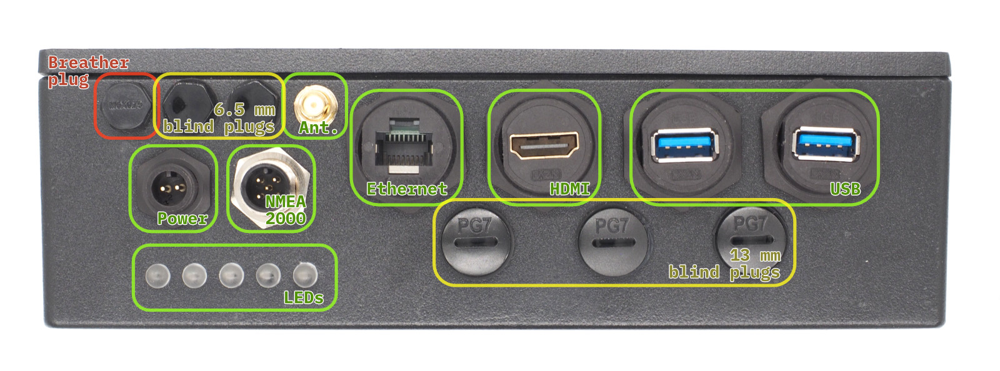
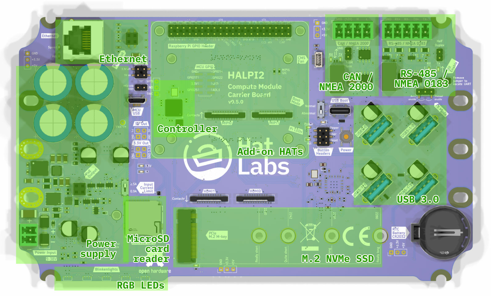
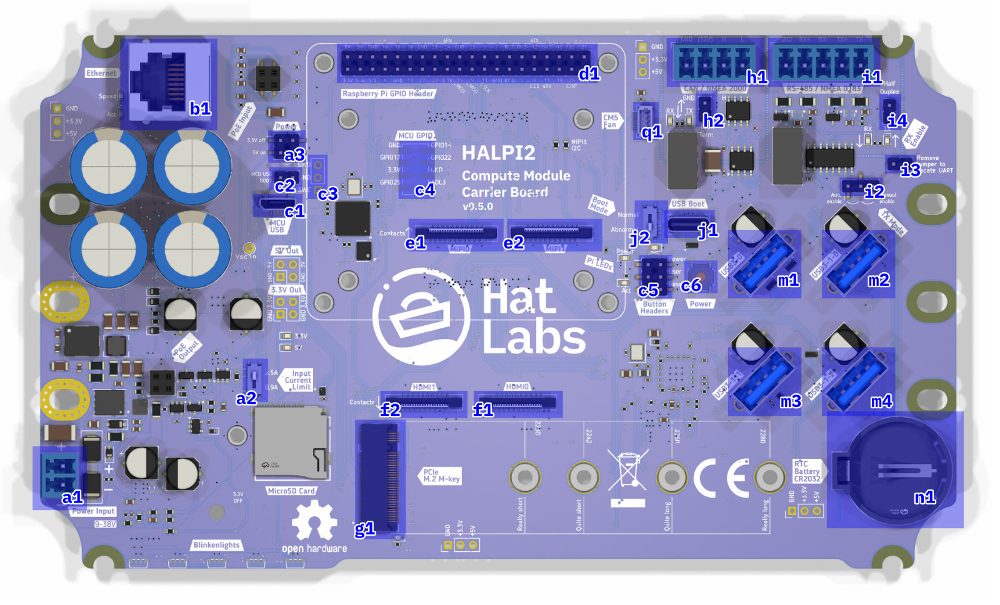
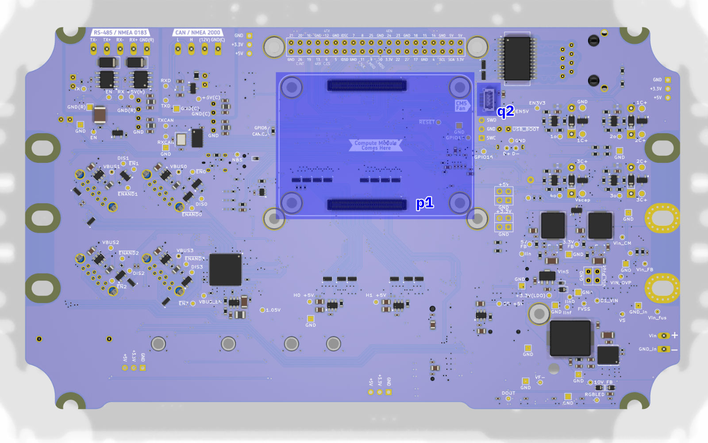
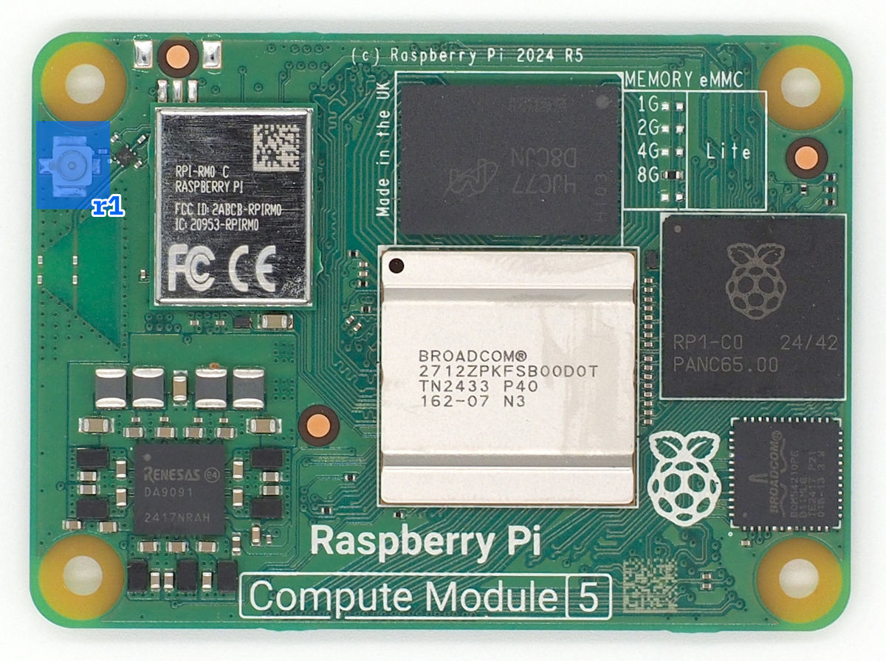
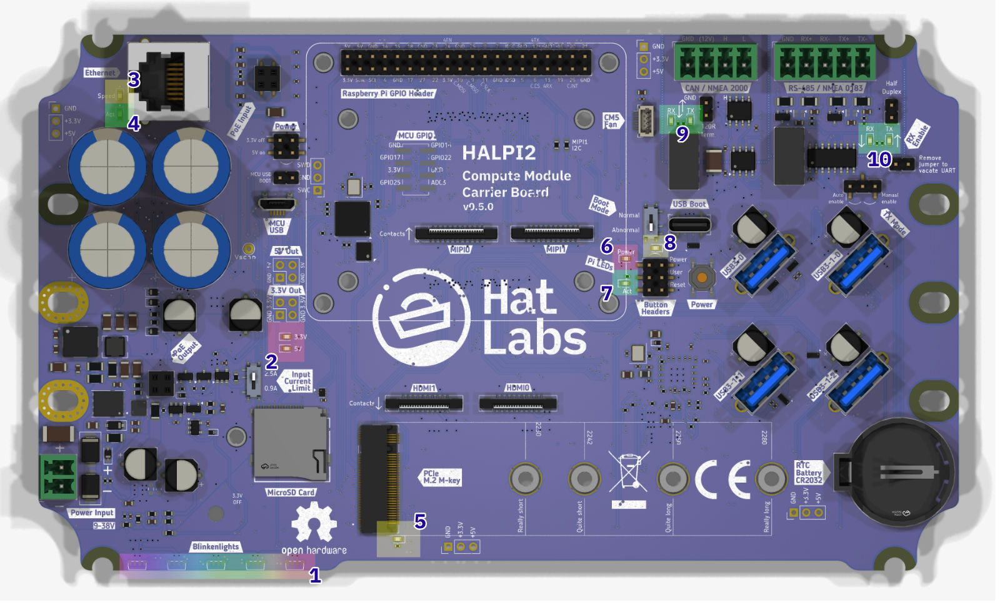
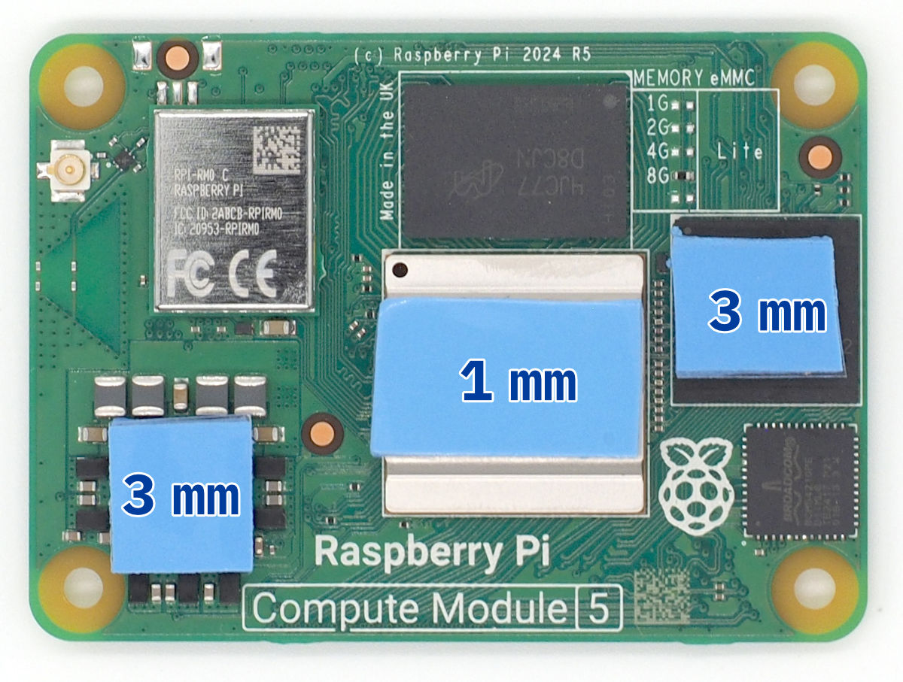

# Hardware Guide

## Enclosure Access

The HALPI2 features a powder-coated die-cast aluminium enclosure with pre-drilled holes for panel connectors. When internal modifications or maintenance are required, the enclosure can be accessed by following the procedures outlined below.

### Opening the Enclosure

To access the internal components, begin by ensuring the unit is completely powered down and power cables are disconnected. The lid is secured with four countersunk M4x10 screws with PH2 heads. Use a PH2 screwdriver to remove these screws and remove the lid.

### Reassembly

Before reassembling the enclosure, take time to verify that all internal connections are secure and properly seated. Route any cables carefully to avoid pinching or creating sharp bends.

It is easy to accidentally connect the flexible flat cables (FFCs) backwards. Observe the Contacts arrows on the silk screen to verify correct orientation.

Pay special attention to the lid gasket, checking for any damage, debris, or displacement that could compromise the enclosure's weather seal.

Reinstall the four M4x10 lid screws using the PH2 screwdriver. Do not over-tighten.

## Panel Connectors

### Standard Configuration

HALPI2 ships with a standard connector configuration suitable for most applications. The default layout includes:

- **E7T power connector**
- **NMEA 2000 micro connector**
- **Gigabit Ethernet RJ45**
- **HDMI output**
- **2× USB 3.0 Type-A**
- **3× PG7 cable gland positions** (with blind plugs)
- **2× RP-SMA antenna positions** (with blind plugs)
- **Breather plug** for pressure equalization

*Front Panel Connectors and Blind Plugs. Connectors marked with green are included in the standard configuration. The yellow positions are blind plugs that can be replaced with connectors as needed. The red position is the breather plug that must not be removed.*

### Custom Connector Options

If you need different connector types, you can modify the panel configuration:

#### Removing Connectors

> ⚠️ **Important**
>
> Only modify connectors when the unit is powered down and disconnected from all sources.
>
> Plastic threads can be damaged by over-torquing. Use standard hex sockets but finger-tighten only.

1. **Use appropriate socket size:**
   - Large connectors: 26mm socket
   - M6 nylon bolts: 10mm socket
   - RP-SMA connectors: 8mm socket
   - PG7 positions: Large flathead screwdriver, 17mm socket

2. **Remove carefully** - plastic threads can be damaged by over-torquing

3. **Keep removed parts** for potential future use

#### Installing New Connectors

1. **Use only marine-grade** or appropriate environment-rated connectors
2. **Ensure proper sealing** - wide flange required on inside
3. **Finger-tighten only** - do not over-torque plastic threads
4. **Test fit** before final installation

## Internal Layout

- The HALPI2 carrier board is the computer mainboard that houses the Compute Module 5 (CM5) on its bottom side and provides power management, indicators and connections for all interfaces.

### Carrier Board Functional Areas

The major carrier board functional areas are illustrated in the image below.

*Carrier board top-side layout, showing key functional areas.*

### Carrier Board Connectors

The functionality is accessed through a number of on-board connectors, shown in the image below.

*Carrier board connectors, top-side.*

A list of the top-side connectors is given below.

| Label | Description |
|:------|:------------|
| **a1** | Power connector (Phoenix MC type, 3.81mm pitch) |
| **a2** | Input current limit switch (0.9A or 2.5A) |
| **a3** | Power control jumper. Short the 3.3V off pins to force the 3.3V rail off. Short the 5V on pins to force the 5V rail on. **NB:** On version 0.4.0 boards, the **a3** and **c2** connectors are organized differently. |
| **b1** | Ethernet port (RJ45) |
| **c1** | Controller USB port. Used for flashing the RP2040 microcontroller firmware. |
| **c2** | MCU USB BOOT jumper header. Short the pins to put the RP2040 into USB boot mode. |
| **c3** | Controller debugging header |
| **c4** | Unpopulated controller GPIO header |
| **c5** | Button headers. Used for connecting Power, Reset and User buttons. |
| **c6** | Power button. Used for powering the Compute Module 5 on and off. |
| **d1** | Raspberry Pi 40-pin GPIO header |
| **e1** | MIPI0 connector for camera or display interface |
| **e2** | MIPI1 connector for camera or display interface |
| **f1** | HDMI0 connector |
| **f2** | HDMI1 connector |
| **g1** | M.2 NVMe SSD connector |
| **h1** | CAN FD interface (Phoenix MC type, 3.81mm pitch) |
| **h2** | CAN terminator jumper. Short the pins to enable the CAN FD bus terminator. |
| **i1** | RS-485 interface (Phoenix MC type, 3.81mm pitch) |
| **i2** | RS-485 auto/manual enable jumper. |
| **i4** | XRS-485 RX Enable jumper. Short the pins to enable RS-485 traffic receiving. |
| **j1** | Compute Module USB Boot connector. Used for flashing the Compute Module 5 firmware. |
| **j2** | Compute Module Boot Mode selection switch. Set to "Normal" for normal operation and "Abnormal" for USB boot mode. A warning LED will light up when the switch is set to "Abnormal". |
| **m1** | USB3 connector 0. Connected directly to the CM5. |
| **m2** | USB3 connector 1-0. Connected to the onboard USB3 hub. |
| **m3** | USB3 connector 1-1. Connected to the onboard USB3 hub. |
| **m4** | USB3 connector 1-2. Connected to the onboard USB3 hub. |
| **n1** | CR2032 battery holder for RTC (Real Time Clock) |
| **q1** | CM5 fan connector. The fan can be used for improving air circulation inside the enclosure. It is not needed when the standard enclosure is used. |

*Carrier board connectors, bottom-side.*

A list of the bottom-side connectors is given below.

| Label | Description |
|:------|:------------|
| **p1** | Compute Module 5 connector. |
| **q1** | CM5 fan connector, alternative location. This header can be used to connect a CPU fan over the CM5 module when using a custom enclosure. **NB:** Connectors **q1** and **q2** are connected in parallel and must not be used simultaneously. |

Finally, the WiFi and Bluetooth antenna connector resides on the Compute Module 5 itself. It is shown in the image below.

*U.FL antenna connector on the Compute Module 5.*

| Label | Description |
|:------|:------------|
| **r1** | U.FL connector for the WiFi and Bluetooth antenna. |

### Blinkenlights

The carrier board features several status LEDs for system monitoring.

*Carrier board status LEDs and their colors.*

The status LEDs provide information about the system's power and activity states. A list of the status LEDs is given below.

| Label | Color | Description |
|-------|:-------|:------------|
| **1** | RGB   | Five RGB LEDs. These LEDs are used for indicating system status and activity on the front panel. |
| **2** | Red   | Power LEDs for the 3.3V and 5V rails. These LEDs indicate the power status of the respective voltage rails. |
| **3** | Yellow| Ethernet speed indicator. On when the Ethernet port has negotiated a 100/1000 Mbps connection. |
| **4** | Green | Ethernet activity indicator. Flashes when there is network traffic on the Ethernet port. |
| **5** | Blue | SSD activity indicator. Flashes when there is read/write activity on the M.2 NVMe SSD. |
| **6** | Red | Pi Power status indicator. Lit when the system is powered but shut down. |
| **7** | Green | Pi activity indicator. Flashes when there is activity on the Raspberry Pi. |
| **8** | Amber | Abnormal Boot Mode warning. On when the USB boot mode switch is set to "Abnormal". This indicates that the device is set to flash via the USB Boot connector and won't boot normally. |
| **9** | Green | CAN TX/RX LEDs. These LEDs flash when data is either received (RX) or transmitted (TX) on the CAN interface. |
| **10** | Green | RS-485 TX/RX LEDs. These LEDs flash when data is either received (RX) or transmitted (TX) on the RS-485 interface. |

The RGB LED patterns are documented in the [Operation Guide](./operation.md#status-led-indicators).

## Current Limiting Configuration

The carrier board features a current limiting switch to configure the maximum current supplied to the peripherals. To locate the switch, refer to the location of switch **a2** in the image in the [Carrier Board Connectors](#carrier-board-connectors) section.

> 🔧 **Current Limit Settings**
>
> **0.9A Setting (Default):**
> - Mandatory for NMEA 2000 bus power
> - Suitable for basic operation
>
> **2.5A Setting:**
> - For high-power peripherals
> - Faster super-capacitor charging
> - Only with dedicated power connection

To change the current limit setting, first power down the HALPI2 completely and remove the enclosure lid following the procedure outlined in the Enclosure Access section. Locate the current limit switch on the carrier board and move the switch to the desired position (either 0.9A or 2.5A). Once the setting has been changed, reassemble the enclosure ensuring all connections remain secure.

## Using HATs

### HAT Compatibility

HALPI2 supports standard Raspberry Pi HATs through its 40-pin GPIO header, maintaining full electrical and mechanical compatibility with the Raspberry Pi HAT specification. The carrier board provides the same GPIO pinout as a standard Raspberry Pi, allowing most HATs designed for Raspberry Pi 4 and 5 to work without modification. This compatibility extends to both official Raspberry Pi HATs and third-party expansion boards that follow the HAT standard.

### Physical Constraints

The HALPI2 enclosure provides 45mm of vertical clearance above the carrier board, sufficient to accommodate up to two stacked HATs. The area to the left of the outlined HAT installation area is occupied by the super-capacitors, limiting the available space for HATs that extend beyond the standard 65mm × 56mm footprint. Pay special attention to HATs with side-mounted connectors. Connectors facing "south" or "east" should be fine but those facing "west" may interfere with the super-capacitors.

### GPIO Pin Conflicts

Several GPIO pins are utilized by HALPI2's built-in interfaces and must be considered when selecting compatible HATs. The following table details the reserved GPIO pins and their functions:

| GPIO Number | Function | Interface | Notes |
|----------|----------|-----------|-------|
| GPIO 2 | I2C SDA | System I2C | Can be shared; address 0x6d reserved |
| GPIO 3 | I2C SCL | System I2C | Can be shared; address 0x6d reserved |
| GPIO 6 | SPI CS | CAN FD | Custom chip select for CAN controller |
| GPIO 9 | SPI MISO | CAN FD | Shared SPI0 bus |
| GPIO 10 | SPI MOSI | CAN FD | Shared SPI0 bus |
| GPIO 11 | SPI SCK | CAN FD | Shared SPI0 bus |
| GPIO 12 | UART TX | RS-485 | UART4 transmit |
| GPIO 13 | UART RX | RS-485 | UART4 receive |
| GPIO 24 | RS-485 EN | RS-485 | Enable signal (manual mode only) |
| GPIO 26 | CAN INT | CAN FD | Interrupt line for CAN controller |

### Interface Sharing and Conflicts

The I2C bus on GPIO 2 and 3 can be shared with HAT devices, as I2C supports multiple devices on the same bus. However, HATs must not use I2C address 0x6d, which is reserved for the HALPI2 system controller. Most I2C HATs will work without issue, but verify the I2C addresses used before installation.

The SPI0 bus used for the CAN FD interface can potentially be shared with other SPI devices, as HALPI2 uses custom chip select (GPIO 6) and interrupt (GPIO 26) pins. HATs using SPI0 with the standard chip select pins (GPIO 7 or GPIO 8) may coexist with the CAN interface but may require additional device tree overlay configuration.

### Disabling Built-in Interfaces

If a HAT requires exclusive use of pins occupied by HALPI2's built-in interfaces, these interfaces can be disabled through hardware modifications. The CAN FD interface can be completely freed by removing the GPIO6-CAN.CS solder jumper located on the bottom side of the carrier board. This modification disconnects the CAN controller from the SPI bus, freeing GPIO 6, 9, 10, 11, and 26 for HAT use.

The RS-485 interface can be disabled by removing the RX Enable jumper (i4) on the carrier board. This prevents the RS-485 transceiver from receiving data and frees GPIO 12 and 13 for other uses. If manual transmit enable control is not required, GPIO 24 can also be repurposed by setting the RS-485 auto/manual enable jumper (i2) to automatic mode.

### Installation Procedure

Begin installation by powering down the system and disconnecting all power sources. Remove the enclosure lid following the procedure outlined in the Enclosure Access section.

Version 0.5.0 and later carrier boards include pre-installed M2.5 threaded inserts at the four HAT mounting positions, simplifying installation. Earlier v0.4.0 boards require M2.5 nuts to be installed manually. For nut installation, the carrier board must be temporarily dismounted. It is possible to do this without disconnecting all cables.

For many common HATs, 15mm standoffs are suitable, but measure the HAT's female header height to ensure correct clearance. The male header base is 2.5mm high, so add this to the female header height to determine the required standoff length.

Thread the standoffs into the mounting holes or secure them with nuts from below on v0.4.0 boards. Align the HAT with the 40-pin GPIO header, ensuring all pins are properly positioned before applying even pressure to seat the connector. The HAT should sit parallel to the carrier board with no visible gap at the GPIO connection.

Secure the HAT using M2.5 screws or additional standoffs through the HAT's mounting holes into the standoffs. These screws are not included with HALPI2 and must be sourced separately. Tighten the screws just enough to secure the HAT without flexing the circuit board.

### Cable Management

If the HAT includes external connectors that need to be accessed from outside the enclosure, consider installing appropriate panel connectors in the available PG7 cable gland positions. This maintains the enclosure's environmental protection while providing convenient external access.

### Removal Procedure

HAT removal follows the installation procedure in reverse. Power down the system completely and disconnect all power sources before opening the enclosure. Remove the M2.5 mounting screws and carefully lift the HAT straight up from the GPIO header, avoiding any lateral force that could bend the header pins.

If the HAT seems stuck, check for any overlooked mounting hardware or cables before applying additional force. Some HATs with tight-fitting connectors may require gentle rocking motion while pulling upward. Rock the HAT in the north-south direction; rocking east-west risks bending the header pins when the connector suddenly releases.

### Software Configuration

After hardware installation, the HAT may require software configuration to function properly. Many HATs include device tree overlays that must be enabled in the Raspberry Pi configuration. Edit `/boot/firmware/config.txt` to add the appropriate `dtoverlay` lines as specified in your HAT's documentation.

> 📖 **Related Information**
>
> - **GPIO pinout reference:** See [Hardware Reference](../technical-reference/hardware.md)
> - **Software configuration:** See [Advanced Configuration](../software-development/advanced-config.md)
> - **Enclosure modifications:** See [Custom Connector Options](#custom-connector-options)

## Replacing the NVMe SSD

### SSD Compatibility

HALPI2 supports M.2 2230-2280 NVMe SSDs in the standard single-sided configuration. While shorter 2230 drives can be double-sided due to the additional clearance at that mounting position, longer drives must be single-sided to fit on the carrier board.

Compatibility can only be guaranteed with SSDs supplied by Hat Labs and official Raspberry Pi SSDs. If considering a third-party drive, verify its compatibility with Raspberry Pi 5 before purchase by checking user reports and compatibility lists online. Common issues with incompatible drives include excessive power consumption, overheating, and boot failures or system instability.

### Preparing the New SSD

Before installing a new SSD in HALPI2, the operating system should be flashed onto the drive. While it is possible to flash the SSD after installation using the CM5's USB Boot connector (j1), using an external USB to NVMe adapter is easier and faster. The flashing procedure is described in the [Software Setup section](../user-guide/software-setup.md) of the User Guide.

### Disabling System 3.3V Voltage

The super-capacitors can keep the carrier board 3.3V rail powered for a significant amount of time after the main power is disconnected. Since the SSD is powered from the 3.3V rail, the rail must be disabled to ensure the SSD is completely unpowered before removal or installation.

Begin by powering down HALPI2 and disconnecting the power supply. Open the enclosure following the procedure described in the Enclosure Access section.

Locate the "3.3V off" jumper on the carrier board. Its location varies depending on the board version. On the v0.4.0 boards, the jumper is very close to the super-capacitors, on their "south" side. On v0.5.0 and later boards, locate the "Pow.Ctrl" header to the "east" of the super-capacitors. The "3.3V off" pins are the top two ones on the header.

Move the jumper to short the 3.3V off pins. This will disable the 3.3V rail, indicated by the LEDs turning off.

### Removal Procedure

The M.2 slot is located at the south edge on the carrier board. Refer to the image in the [Carrier Board Connectors](#carrier-board-connectors) section to locate the M.2 connector labeled **g1**.

Using a PH1 screwdriver, remove the M2.5 mounting screw. Once the screw is removed, the SSD will spring up at an angle. Gently lift the drive from the mounting end and wiggle it out of the M.2 connector. Handle the SSD by its edges to avoid damaging the components or connectors.

### Installation Procedure

Insert the prepared SSD into the M.2 connector at approximately a 30-degree angle, ensuring the notch in the SSD aligns with the key in the connector. The drive should slide in smoothly without requiring force. Once fully seated, press down the mounting end of the SSD until it lies flat against the standoff.

Secure the SSD with the M2.5 mounting screw using a PH1 screwdriver. Tighten the screw just enough to hold the drive firmly in place. The SSD should lie perfectly flat with no visible bend or flex.

Once the SSD is in place, remove the jumper from the 3.3V off pins to re-enable the 3.3V rail. Keep the jumper stored on the header for future use.

Reassemble the enclosure as described in the Enclosure Access section.
For any software configuration or troubleshooting, refer to the Software Setup chapter in the User Guide.

> 📖 **Related Information**
>
> - **System images:** See [Software Setup](./software-setup.md)
> - **Boot procedures:** See [System Operation](./operation.md)
> - **Hardware access:** See [Enclosure Access](#enclosure-access)

## Replacing the Compute Module 5

### Prerequisites

Replacing the Compute Module 5 requires careful handling due to the delicate nature of the board-to-board connectors. The CM5 uses two high-density connectors that can be easily damaged if excessive force or improper technique is used. Only unmount an existing module if it is absolutely necessary, such as when the module is damaged or needs to be upgraded. Damage to the compute module mounting connectors on either the CM5 or the carrier board is not covered by warranty.

Before beginning, ensure you have thermal pads available for heat transfer. The standard configuration uses a 1mm thick pad on the SoC and 2mm thick pads on the RP1 chip and internal power supply components. Existing thermal pads can be reused if they remain intact and clean.

### Accessing the Compute Module

Power down the HALPI2 and disconnect the power source. Remove the enclosure lid following the procedure in the Enclosure Access section. To access the CM5, which is mounted on the underside of the carrier board, you must first unmount the carrier board from the enclosure. To keep track of the numerous cables connected to the carrier board, it is recommended to take a few photos of the connections before proceeding.

Disconnect any cables that prevent the carrier board from being lifted. Remove the carrier board mounting screws and lift the board from the enclosure.

### Removing the Existing Module

 > ‼️ **Caution**
 >
 > If the CM5 module is disconnected one connector at a time, the twist forces can rip the connector off the CM5 module. This damage is not covered by warranty.

The CM5 is secured by two board-to-board connectors that require careful handling. Never use metal tools for this procedure as they can damage the connectors or nearby surface-mounted components. Use a wooden or plastic spudger, guitar pick, or similar non-conductive tool.

Position your tool at the center of left-hand side short edge of the CM5 module, between the module and the carrier board. Press down firmly at the right-hand side corners. Gently pry upward with minimal force – the module should be released with a light click, with both connectors detaching simultaneously.

*Unmount the CM5 module by pressing down at the right edge corners while prying upward at the center of the left edge. Both connectors should detach simultaneously.*

### Installing the New Module

Align the new CM5 module with the carrier board connectors, using the silk screen outline on the carrier board as a guide. The module outline printed on the carrier board should match the CM5's physical dimensions exactly when properly oriented.

Once aligned, apply gentle, even pressure at the connector locations on both short edges of the module. You should feel the connectors engage with a subtle click. Press firmly but avoid flexing the carrier board – support the board from underneath if necessary. Both connectors must be fully seated for proper operation.

Now, add thermal pads on the CM5 module. The thermal pads should be positioned correctly: 1 mm pad on the main SoC, and 3 mm pads on the RP1 chip and power supply components. If reusing existing pads, ensure they are clean and properly positioned.

*Thermal pad placement on the Compute Module 5. Use 1 mm thick pad on the SoC (center) and 3 mm thick pads on the RP1 and power supply components. The actual thermal pad shapes and sizes may vary.*

### Antenna Connection

Before remounting the carrier board, connect the U.FL antenna cable to the CM5's wireless antenna connector. This connection is impossible to access once the carrier board is reinstalled. The U.FL connector requires careful alignment and firm pressure to seat properly. You should feel a distinct snap when the connector is fully engaged. Be careful not to bend the connector shell during installation.

### Final Assembly

Inspect the module installation to ensure both connectors are fully seated and the module lies flat against the carrier board with no gaps. The thermal pads should make contact with the module's heat-generating components.

Position the carrier board back in the enclosure, ensuring the thermal pads on the CM5 align with the corresponding heat spreading areas on the enclosure bottom. Reinstall all carrier board mounting screws and reconnect any cables that were disconnected during removal.

Complete the reassembly following the standard enclosure closure procedure. On first boot, the system should recognize the new CM5 automatically.

> ⚠️ **Connector Warning**
>
> The board-to-board connectors are the most fragile components in this procedure. Never use metal tools near the connectors, apply only vertical force when removing or installing, and ensure perfect alignment before applying pressure. Damaged connectors typically require carrier board replacement.

> 📖 **Related Information**
>
> - **System setup after replacement:** See [Software Setup](./software-setup.md)
> - **Boot troubleshooting:** See [Troubleshooting](./troubleshooting.md)
> - **Thermal management:** See [Hardware Reference](../technical-reference/hardware.md)
